# Equinix Java SDK

[](https://opensource.org/licenses/Apache-2.0)
[](https://openjdk.java.net/)
[](https://iantjones.github.io/equinix-java-sdk/)
[](https://central.sonatype.com/artifact/com.eqixiac.equinix/equinix-sdk-java)

> A Java client for the Equinix platform APIs — Fabric, Network Edge, Customer Portal, IBX SmartView, Internet Access, Projects, IAM, and STS — plus a `Design` module (metro optimizer, deployment wizard, peering intelligence, cost calculators).

**[View Full API Documentation (Javadoc)](https://iantjones.github.io/equinix-java-sdk/)** · **[Maven Central](https://central.sonatype.com/artifact/com.eqixiac.equinix/equinix-sdk-java)**

## What's in the box

The SDK covers all eight Equinix API domains — Fabric, Network Edge, Customer Portal, IBX SmartView,
Internet Access, Projects, IAM, and STS — with fluent builders for both create and update. A few
things it handles so you don't have to:

- **OAuth2**, token refresh on expiry included. Open an `Equinix` session and every domain shares a
  single token and connection pool.
- **Pagination** — `loadAll()`/`stream()` when you want the whole set, lazy paging when you don't.
- **Errors** mapped from HTTP status onto a typed exception hierarchy you can actually `catch`.
- **Cloud provider adapters** — AWS Direct Connect, Azure ExpressRoute, Google Cloud Interconnect,
  Oracle FastConnect — that drop straight into the Fabric connection builder.
- **Dry-run validation** for Fabric connections and service tokens before you commit to anything.
- **Real-time streaming** from IBX SmartView (AWS IoT, Azure Event Hub, webhook, REST).

On top of the raw API, the **`Design`** module is for planning rather than provisioning: a
metro-placement optimizer, a deployment wizard that turns a plan into provisioned Fabric resources,
peering intelligence built on PeeringDB, IBX-to-IBX latency estimates, and Fabric-vs-internet cost
calculators.

And the whole thing doubles as an **MCP server for AI agents**: one build produces a runnable
`-mcp-server.jar` that Claude Desktop, Claude Code, Cursor, or VS Code launch over stdio, exposing
the design engines and cross-domain reads as 12 read-only tools — plus an opt-in dry-run-first
mutation broker — under your own API credentials. See
[Intelligence MCP Server](#intelligence-mcp-server-run-the-sdk-as-an-mcp-server). It's a community
server, not affiliated with Equinix.

## Quick Start

### Maven Dependency

```xml
<dependency>
    <groupId>com.eqixiac.equinix</groupId>
    <artifactId>equinix-sdk-java</artifactId>
    <version>3.0.0</version>
</dependency>
```

### Authentication

All domain clients use OAuth2 client credentials. Obtain your Client ID and Client Secret from the [Equinix Developer Portal](https://developer.equinix.com/).

```java
import com.eqixiac.equinix.Fabric;
import com.eqixiac.equinix.core.auth.BasicEquinixCredentials;

BasicEquinixCredentials credentials = new BasicEquinixCredentials("YOUR_CLIENT_ID", "YOUR_CLIENT_SECRET");
Fabric fabric = new Fabric(credentials);
// Authentication happens automatically on first API call
```

To resolve or rotate credentials at runtime — from a secrets manager, for example — implement
`EquinixCredentialsProvider` and pass it instead of a fixed credentials object. It is consulted on
each authentication (the first call and re-auth on expiry), so a rotated secret takes effect without
rebuilding the client:

```java
import com.eqixiac.equinix.core.auth.EquinixCredentialsProvider;

EquinixCredentialsProvider provider = () -> new BasicEquinixCredentials(vault.clientId(), vault.clientSecret());
Fabric fabric = new Fabric(provider);          // also: new Equinix(provider), new NetworkEdge(provider), ...
```

### One session for multiple domains

Each `new Fabric(creds)` / `new NetworkEdge(creds)` stands up its **own** OAuth token and
connection pool. When you use more than one domain, open an `Equinix` session instead — it owns a
**single** token + pool and shares it across every domain (and the design facade):

```java
import com.eqixiac.equinix.Equinix;

try (Equinix eq = new Equinix(credentials)) {     // one token, one pool
    Fabric fabric    = eq.fabric();
    NetworkEdge edge = eq.networkEdge();           // shares the same token + pool
    Design design    = eq.design();                // value-add engines over the shared Fabric
}                                                  // closed once for the whole session
```

The standalone `new Fabric(credentials)` constructors remain for the single-domain case.

### Metros and new locations

`MetroCode` is a convenience enum of well-known metros. Because Equinix adds metros over time, the
SDK never depends on the enum being complete:

- Reads never fail on an unlisted metro — a metro the enum does not list deserializes to
  `MetroCode.UNKNOWN`, and the model preserves the real code via `metro.metroId()`.
- `Metro.metroId()` returns a `MetroId` (a normalized code string) that names *any* metro;
  `metroId().asMetroCode()` bridges back to the enum when the metro is well-known.
- `fabric.metroRegistry()` is a cached, live snapshot of every metro (and its IBX data centers)
  from the Metros API — the authoritative set — keyed by `MetroId`:

```java
MetroRegistry registry = fabric.metroRegistry();
registry.get("SV").ifPresent(m -> System.out.println(m.getName() + " " + m.getIbxs()));
boolean exists = registry.contains(someNewCode);   // true even if absent from MetroCode

// Provision against a metro the enum doesn't list yet:
fabric.cloudRouters().define()
    .name("fcr").inMetro("ZZ")
    .withPackage(GatewayPackageCode.STANDARD)
    .notification(NotificationType.ALL, List.of("ops@example.com"))   // Fabric requires >= 1 recipient
    .create();
fabric.metros().getByMetroCode("ZZ");    // MetroCode and String overloads; getByMetroId(MetroId) for registry keys
```

By default the catalog is loaded eagerly on the first explicit `authenticate()` (so it's ready up
front) and otherwise lazily on first `metroRegistry()` access. Control this — and the other
construction-time options — with `EquinixConfig`:

```java
Fabric fabric = new Fabric(credentials, EquinixConfig.builder()
    .sandbox(false)
    .autoLoadMetros(false)              // keep the catalog lazy instead of loading it at auth
    .enrichMetroRegistry(true)          // merge EIA per-IBX detail into the metro registry
    .retryPolicy(RetryPolicy.none())    // override the default retry behavior
    .peeringDbApiKey("...")             // PeeringDB credential for peeringIntelligence()
    .build());
// Equinix and every domain client accept EquinixConfig the same way.
```

`enrichMetroRegistry` turns the registry into the SDK's cross-source location directory: Fabric
supplies the metro-level picture (centroids, connected-metro latency, IBX codes) and EIA supplies
the per-IBX detail (coordinates, country) — the only API that has it. The merge is best-effort
(an EIA outage never fails the registry load), and it feeds IBX-to-IBX latency directly:

```java
MetroRegistry registry = fabric.metroRegistry();   // or eq.metroRegistry() on a session
Ibx sv5 = registry.ibx("SV5").orElseThrow();       // full EIA record, case-insensitive lookup
Ibx la4 = registry.ibx("LA4").orElseThrow();
double rttFloor = SpeedOfLightLatency.roundTrip().millisBetween(sv5, la4);
List<Ibx> svIbxes = registry.ibxDetails("SV");     // every enriched IBX in a metro

registry.refresh();   // re-pulls both sources at runtime, atomically, in place —
                      // existing references see new metros/IBXes immediately
```

## Domain Overview

| Domain | Entry Point | Resources | Description |
|--------|-------------|-----------|-------------|
| **Fabric** | `new Fabric(creds)` | 28 | Connections (+ advertised/received routes), Ports (+ search/VLANs), Service Tokens, Cloud Routers (+ route search/commands/validate), Networks, Streams (+ Subscriptions/Alert Rules/Assets), Precision Time (+ packages), Route Filters/Aggregations (+Rules), Routing Protocols (+ BGP actions), Service Profiles, Prices, Metrics, Cloud Events, Marketplace Subscriptions, IP Blocks, Agents (+Templates), Company Profiles (+Tags), Port Packages, Health — all mutable resources support fluent `update()` |
| **Network Edge** | `new NetworkEdge(creds)` | 8 | Virtual Devices (+ soft-reboot/RMA/ACL/file upload), ACL Templates, VPNs, BGP Peerings, Device Links, Public Keys, Backups, Setup |
| **Customer Portal** | `new CustomerPortal(creds)` | 22 | Orders, Order History, Cross-Connects, Trouble Tickets (+ Ticket Orders), Work Visits, Smart Hands, Shipments, Secure Cabinets, Invoices, Billing Accounts, Quotes, Assets, Attachments, Reports, Notifications, Unified Notifications, Support Cases, Support Plans, Digital LOAs, Lookups |
| **IBX SmartView** | `new IBXSmartView(creds)` | 8 | Environmental Sensors, Power Events (`dcim/v3`), System Alerts, Streaming Subscriptions, Asset Management, Hierarchy, Legacy Environmentals, Legacy Power |
| **Internet Access** | `new InternetAccess(creds)` | 14 | EIA v2 Services (full lifecycle), IBX availability, EIA v1 Prices, Accounts, Terms & Conditions, Operational Units, Signature Policies, Product Configurations, Purchase Orders, Orders, Cages, Cabinets, Patch Panels, Connection Services |
| **Projects** | `new Projects(creds)` | 1 | Project listing (read-only, `resourceManager/v2`) |
| **IAM** | `new IAM(creds)` | 8 | Roles, Role Assignments, Access Policies (+Grants), Permission Sets, Principal Policies, Policy Masks, Effective Permissions, Resource Types |
| **STS** | `new STS(creds)` | 3 | Token issuance, OIDC Providers (+suspend/resume), JWKS/OpenID discovery |
| **Design** (value-add) | `Design.over(fabric)` / `eq.design()` / `Fabric.optimizeMetros()` … | — | Metro Optimizer, Deployment Wizard, Peering Intelligence, Cost & Value Engineering (rate cards, savings calculator, TCO comparison), Terraform export, topology diagrams (`com.eqixiac.equinix.design.*`) — a facade over an existing Fabric client (reuses its transport) |

## Usage Examples

### Fabric: Working with Connections

```java
Fabric fabric = new Fabric(credentials);

// List all connections
PaginatedFilteredList<Connection> connections = fabric.connections().search();
for (Connection conn : connections) {
    System.out.println(conn.getName() + " - " + conn.getState());
}

// Get a specific connection
Connection connection = fabric.connections().getByUuid("your-connection-uuid");

// Get connection statistics
ConnectionStatistic stats = fabric.connections().getStatistics(
    connection.getUuid(),
    LocalDateTime.now().minusDays(1),
    LocalDateTime.now()
);
```

### Fabric: Creating a Connection with the Fluent Builder

```java
Connection newConnection = fabric.connections()
    .define(ConnectionType.EVPL_VC)
    .name("My-AWS-Connection")
    .bandwidth(50)
    .redundancy("my-group", RedundancyPriority.PRIMARY)
    .aSideAccessPointPort(portUuid, LinkProtocol.dot1q().vlanTag(1000).create())
    .zSideAccessPointServiceProfile(profileUuid, LinkProtocol.dot1q().vlanTag(1000).create())
    .notification("ops@example.com")
    .create();

System.out.println("Created: " + newConnection.getUuid());
```

### Fabric: Dry Run Validation

Validate a connection without actually creating it:

```java
Connection validated = fabric.connections()
    .define(ConnectionType.EVPL_VC)
    .name("Test-Connection")
    .bandwidth(100)
    .aSideAccessPointPort(portUuid, LinkProtocol.dot1q().vlanTag(2000).create())
    .zSideAccessPointServiceProfile(profileUuid, LinkProtocol.dot1q().vlanTag(2000).create())
    .dryRun()    // Validates without creating
    .create();
// Returns validation result without side effects
```

### Fabric: Port Discovery and Statistics

```java
// List all ports and find DOT1Q ports
PaginatedList<Port> ports = fabric.ports().list();
Port dot1qPort = ports.stream()
    .filter(p -> p.getEncapsulation().getType() == EncapsulationType.DOT1Q)
    .findFirst()
    .orElseThrow();

// Get port statistics
PortStatistic stats = fabric.ports().getStatistics(
    dot1qPort.getUuid(),
    LocalDateTime.now().minusHours(24),
    LocalDateTime.now()
);
```

### Fabric: Cloud Routers and Routing

```java
// List cloud routers
PaginatedFilteredList<CloudRouter> routers = fabric.cloudRouters().search();

// Get available router packages
PaginatedList<CloudRouterPackage> packages = fabric.cloudRouters().routerPackages();

// List routing protocols for a connection
PaginatedList<RoutingProtocol> protocols = fabric.routingProtocols().list(connectionId);

// Route filters
PaginatedFilteredList<RouteFilter> filters = fabric.routeFilters().search();
```

### Fabric: Real-Time Streams

```java
// List streams
PaginatedList<Stream> streams = fabric.streams().list();

// Create a stream subscription
StreamSubscription sub = fabric.streamSubscriptions()
    .define(streamId)
    .withName("My-Subscription")
    .create();

// List subscriptions for a stream
PaginatedList<StreamSubscription> subs = fabric.streamSubscriptions().list(streamId);
```

### Fabric: Cloud Provider SDK Interoperability

Cloud provider adapters let you hand a provider's own SDK object — an AWS `Connection`, an Azure ExpressRoute service key, a GCP pairing key, an Oracle virtual-circuit OCID — straight to the Fabric connection builder, instead of copying the fields across yourself.

#### Built-in Adapters

| Cloud Provider | Adapter Class | Authentication Key | Region Format |
|---------------|--------------|-------------------|---------------|
| **AWS** | `AwsDirectConnectAdapter` | 12-digit AWS Account ID | `us-east-1` |
| **Azure** | `AzureExpressRouteAdapter` | ExpressRoute Service Key (GUID) | `Silicon Valley` |
| **Google Cloud** | `GoogleCloudInterconnectAdapter` | GCP Pairing Key | `us-east1` |
| **Oracle Cloud** | `OracleFastConnectAdapter` | Virtual Circuit OCID | `us-ashburn-1` |

#### AWS Direct Connect

```java
// Option 1: Wrap an AWS SDK object
AwsDirectConnectAdapter<Connection> adapter = new AwsDirectConnectAdapter<>(
    awsConnection,                              // AWS SDK Connection object
    awsConnection.getOwnerAccount(),            // 12-digit AWS Account ID
    awsConnection.getRegion(),                  // e.g., "us-east-1"
    "equinix-aws-service-profile-uuid"          // Equinix service profile for AWS
);

// Option 2: Manual construction (no AWS SDK dependency)
AwsDirectConnectAdapter<?> adapter = AwsDirectConnectAdapter.of(
    "123456789012", "us-east-1", "equinix-aws-profile-uuid");

// Use the adapter in the connection builder
Connection conn = fabric.connections()
    .define(ConnectionType.EVPL_VC)
    .name("Port-to-AWS-DirectConnect")
    .bandwidth(100)
    .aSideAccessPointPort(portUuid, LinkProtocol.dot1q().vlanTag(1000).create())
    .zSideCloudProvider(adapter, LinkProtocol.dot1q().vlanTag(1000).create())
    .notification("ops@example.com")
    .create();
```

#### Azure ExpressRoute

```java
// Azure requires a peering type (PRIVATE or MICROSOFT)
AzureExpressRouteAdapter<?> adapter = AzureExpressRouteAdapter.of(
    "xxxxxxxx-xxxx-xxxx-xxxx-xxxxxxxxxxxx",     // ExpressRoute Service Key
    "Silicon Valley",                            // Peering location
    "equinix-azure-profile-uuid",                // Equinix service profile
    PeeringType.PRIVATE                          // Private or Microsoft peering
);

Connection conn = fabric.connections()
    .define(ConnectionType.EVPL_VC)
    .name("Port-to-Azure-ExpressRoute")
    .bandwidth(200)
    .aSideAccessPointPort(portUuid, LinkProtocol.dot1q().vlanTag(1500).create())
    .zSideCloudProvider(adapter, LinkProtocol.dot1q().vlanTag(1500).create())
    .notification("ops@example.com")
    .create();
```

#### Google Cloud Interconnect

```java
GoogleCloudInterconnectAdapter<?> adapter = GoogleCloudInterconnectAdapter.of(
    "xxxx/xxxx/xxxx/xxxx",                      // GCP Pairing Key
    "us-east1",                                  // GCP region
    "equinix-gcp-profile-uuid"                   // Equinix service profile
);

Connection conn = fabric.connections()
    .define(ConnectionType.EVPL_VC)
    .name("Port-to-GCP-Interconnect")
    .bandwidth(100)
    .aSideAccessPointPort(portUuid, LinkProtocol.dot1q().vlanTag(2000).create())
    .zSideCloudProvider(adapter, LinkProtocol.dot1q().vlanTag(2000).create())
    .notification("ops@example.com")
    .create();
```

#### Custom Adapter

Implement `CloudProviderConnectionAdapter<T>` for any cloud provider not covered by the built-in adapters:

```java
public class IbmDirectLinkAdapter implements CloudProviderConnectionAdapter<Void> {

    private final String serviceKey;
    private final String region;
    private final String profileUuid;

    public IbmDirectLinkAdapter(String serviceKey, String region, String profileUuid) {
        this.serviceKey = serviceKey;
        this.region = region;
        this.profileUuid = profileUuid;
    }

    @Override public String getServiceProfileUuid()  { return profileUuid; }
    @Override public String getAuthenticationKey()   { return serviceKey; }
    @Override public String getSellerRegion()        { return region; }
    @Override public Void getSource()                { return null; }
    @Override public CloudProviderType getProviderType() { return CloudProviderType.IBM_CLOUD; }
}

// Use exactly like the built-in adapters
Connection conn = fabric.connections()
    .define(ConnectionType.EVPL_VC)
    .name("IBM-DirectLink")
    .bandwidth(50)
    .aSideAccessPointPort(portUuid, LinkProtocol.dot1q().vlanTag(500).create())
    .zSideCloudProvider(new IbmDirectLinkAdapter(serviceKey, "us-south", profileUuid),
                        LinkProtocol.dot1q().vlanTag(500).create())
    .notification("ops@example.com")
    .create();
```

#### Multi-Cloud with Dry Run Validation

Combine cloud provider adapters with Dry Run to validate multi-cloud connections before creating them:

```java
AwsDirectConnectAdapter<?> awsAdapter = AwsDirectConnectAdapter.of(
    "123456789012", "us-east-1", awsProfileUuid);

AzureExpressRouteAdapter<?> azureAdapter = AzureExpressRouteAdapter.of(
    "service-key", "Silicon Valley", azureProfileUuid, PeeringType.PRIVATE);

// Validate AWS connection (dry run - no resources created)
Connection awsValidated = fabric.connections()
    .define(ConnectionType.EVPL_VC)
    .name("AWS-Primary")
    .bandwidth(100)
    .aSideAccessPointPort(portUuid, LinkProtocol.dot1q().vlanTag(1000).create())
    .zSideCloudProvider(awsAdapter, LinkProtocol.dot1q().vlanTag(1000).create())
    .notification("ops@example.com")
    .dryRun()
    .create();

// Validate Azure connection (dry run)
Connection azureValidated = fabric.connections()
    .define(ConnectionType.EVPL_VC)
    .name("Azure-Secondary")
    .bandwidth(200)
    .aSideAccessPointPort(portUuid, LinkProtocol.dot1q().vlanTag(1500).create())
    .zSideCloudProvider(azureAdapter, LinkProtocol.dot1q().vlanTag(1500).create())
    .notification("ops@example.com")
    .dryRun()
    .create();

// Both validated successfully - now create for real (remove .dryRun())
```

### Fabric: Metro Optimizer

Give the optimizer your sites, the providers you need to reach, your workloads, and your constraints,
and it ranks Equinix metros — and tells you why each one landed where it did. You get back a latency
matrix, a suggested workload-to-metro layout, a risk assessment, and a cost estimate.

Scoring weighs five things: latency, provider coverage, cost, redundancy, and compliance. The numbers
come from live Fabric data — inter-metro latency from `Metro.connectedMetros`, provider availability
from `ServiceProfile.metros()`, and pricing from the Prices API — not from a static table.

#### Defining the Optimization

```java
import com.eqixiac.equinix.Fabric;
import com.eqixiac.equinix.core.enums.MetroCode;
import com.eqixiac.equinix.fabric.model.implementation.cloud.CloudProviderType;
import com.eqixiac.equinix.design.optimizer.enums.*;
import com.eqixiac.equinix.design.optimizer.model.*;

Fabric fabric = new Fabric(credentials);

OptimizationResult result = fabric.optimizeMetros()

    // ── Sites: where your people and operations are ──
    .addSite("New York HQ")
        .nearestMetro(MetroCode.NY)
        .role(SiteRole.HEADQUARTERS)
        .headcount(500)
        .done()
    .addSite("London Office")
        .nearestMetro(MetroCode.LD)
        .role(SiteRole.EMPLOYEE_HUB)
        .headcount(200)
        .done()
    .addSite("Singapore Office")
        .coordinates(1.3521, 103.8198)      // lat/lng when metro code isn't known
        .role(SiteRole.PRIMARY_MARKET)
        .headcount(150)
        .done()
    .addSite("Frankfurt Data Center")
        .nearestMetro(MetroCode.FR)
        .role(SiteRole.DATA_CENTER)
        .headcount(25)
        .done()

    // ── Providers: what you need to connect to ──
    .requireProvider(CloudProviderType.AWS)
        .sellerRegions("us-east-1", "eu-west-1")
        .done()
    .requireProvider(CloudProviderType.AZURE)
        .done()
    .preferProvider("Zoom Video Communications")    // match by service profile name
        .done()
    .preferProvider(CloudProviderType.GOOGLE_CLOUD)
        .done()

    // ── Workloads: what you're running and where it matters ──
    .addWorkload("ML Training Pipeline")
        .type(WorkloadType.AI_ML_TRAINING)          // pre-built profile: high power, liquid cooling
        .bandwidthMbps(10_000)
        .requiresHighPowerDensity()
        .dependsOn(CloudProviderType.AWS)
        .done()
    .addWorkload("Global Video Conferencing")
        .type(WorkloadType.REALTIME_COLLABORATION)  // pre-built: latency-critical, proximity-weighted
        .latencySensitivity(LatencySensitivity.CRITICAL)
        .bandwidthMbps(1_000)
        .done()
    .addWorkload("Customer API Platform")
        .type(WorkloadType.TRANSACTIONAL)
        .bandwidthMbps(2_000)
        .maxLatencyToleranceMs(25.0)                // per-workload latency ceiling
        .dependsOn(CloudProviderType.AZURE)
        .done()
    .addWorkload("Disaster Recovery")
        .type(WorkloadType.DISASTER_RECOVERY)       // pre-built: cost-optimized, relaxed latency
        .bandwidthMbps(500)
        .dependsOn(CloudProviderType.AZURE)
        .done()
    .addWorkload("Genomics Analysis")
        .type(WorkloadType.CUSTOM)                  // fully custom workload profile
        .profile(WorkloadProfile.builder()
            .defaultLatencySensitivity(LatencySensitivity.MEDIUM)
            .requiresHighPowerDensity(true)
            .requiresLiquidCooling(true)
            .maxLatencyToleranceMs(50.0)
            .minBandwidthMbps(5000.0)
            .build())
        .dependsOn(CloudProviderType.AWS)
        .done()

    // ── Constraints: business and compliance boundaries ──
    .constraints()
        .monthlyBudget(50_000, 150_000)             // USD range
        .redundancy(RedundancyTier.MULTI_REGION)    // metros across 2+ regions
        .compliance(ComplianceZone.EU_GDPR)         // at least one EU metro
        .maxLatencyMs(100)                          // hard filter: metros >100ms to any site are excluded
        .excludeMetro(MetroCode.MX)                 // exclude specific metros
        .maxMetros(5)
        .done()

    // ── Strategy and scoring tuning ──
    .strategy(OptimizationStrategy.BALANCED)
    .scoringWeights(ScoringWeights.builder()
        .latencyWeight(0.35)                        // increase latency importance
        .costWeight(0.15)                           // decrease cost importance
        .latencyExcellentMs(8.0)                    // tighter latency grading curve
        .build())

    // ── Execute ──
    .optimize();
```

#### Working with Results

```java
// ── Quick summary ──
System.out.println(result.toSummary());
// Output:
// Recommended primary metro: Ashburn (DC) with a score of 87.3/100.
// Additional metros: Amsterdam (AM), Silicon Valley (SV), Singapore (SG).
// Estimated monthly cost: $8,750.00 USD.
// Computed in 1243ms.

// ── Primary recommendation ──
MetroRecommendation primary = result.primaryMetro();
System.out.println(primary.getMetroId());             // DC (MetroId.toString() is the code)
System.out.println(primary.getScore().getComposite()); // 87.3
System.out.println(primary.getReasons());
// [Excellent average latency of 12.4ms to user sites,
//  All 4 required/preferred providers available,
//  Located in AMER region]

// ── Score breakdown ──
MetroScore score = primary.getScore();
System.out.println("Latency:    " + score.latencyScore());      // 91.2
System.out.println("Providers:  " + score.providerScore());     // 100.0
System.out.println("Cost:       " + score.costScore());         // 80.0
System.out.println("Redundancy: " + score.redundancyScore());   // 90.0
System.out.println("Compliance: " + score.complianceScore());   // 100.0

// ── Latency matrix (ASCII table) ──
System.out.println(result.getLatencyMatrix().toTableString());
// Metro |  New York HQ | London Office | Singapore Office | Frankfurt DC
// ------+--------------+---------------+------------------+-------------
// DC    |         8.2  |        73.4   |           198.5* |        89.1
// AM    |        73.1  |        10.2   |           162.3* |        7.8
// SV    |        61.5  |       138.7*  |           172.1* |       152.3*
// SG    |       230.1* |       171.2*  |             1.4  |       163.8*
//
// * = estimated (no direct latency data available)

// ── Deployment topology ──
DeploymentTopology topology = result.getTopology();
System.out.println(topology.summary());
// Deployment Topology:
//   DC:
//     - Customer API Platform (All required providers available)
//     - Global Video Conferencing (Lowest weighted latency to user sites (12.4ms avg))
//   SV:
//     - ML Training Pipeline (All required providers available)
//     - Genomics Analysis (All required providers available)
//   AM:
//     - Disaster Recovery (Placed in EMEA for geographic diversity from primary)
//   SG:
//     - (edge presence for APAC workforce)

// ── Risk assessment ──
RiskAssessment risks = result.getRiskAssessment();
System.out.println("Resiliency: " + risks.getResiliencyScore() + "/100");
for (RiskFinding finding : risks.getFindings()) {
    System.out.println("[" + finding.getSeverity() + "] " + finding.getDescription());
    if (finding.getRecommendation() != null) {
        System.out.println("  → " + finding.getRecommendation());
    }
}
// [MEDIUM] SG has worst-case latency of 230.1ms which exceeds the 100ms threshold
//   → Consider adding a metro closer to the affected site
// [MEDIUM] Amazon Web Services is only available in 1 of 4 recommended metros
//   → Consider selecting metros where Amazon Web Services has broader presence

// ── Cost estimate ──
CostEstimate cost = result.getCostEstimate();
System.out.println("Monthly: $" + cost.getMonthlyTotal() + " " + cost.getCurrency());
System.out.println("Setup:   $" + cost.getSetupTotal());
System.out.println("Budget:  " + (cost.isWithinBudget() ? "WITHIN" : "OVER"));
for (MetroCostBreakdown metro : cost.getPerMetro()) {
    System.out.println("  " + metro.getMetroId() + ": $" + metro.getMonthlyRecurring() + "/mo");
}

// ── Full markdown report (for architecture review docs) ──
String report = result.toMarkdown();
Files.writeString(Path.of("metro-optimization-report.md"), report);

// ── JSON export (for programmatic consumption) ──
String json = result.toJson();
```

#### Optimization Strategies

The optimizer supports five pre-built strategies that set default scoring weights, plus full customization via `ScoringWeights`:

| Strategy | Latency | Providers | Cost | Redundancy | Compliance | Best For |
|----------|--------:|----------:|-----:|-----------:|-----------:|----------|
| `BALANCED` | 30% | 25% | 20% | 15% | 10% | General-purpose planning |
| `LATENCY_FIRST` | 50% | 20% | 10% | 10% | 10% | Real-time apps, trading |
| `COST_FIRST` | 15% | 15% | 45% | 15% | 10% | Budget-constrained |
| `REDUNDANCY_FIRST` | 20% | 15% | 15% | 40% | 10% | Mission-critical infra |
| `PROVIDER_COVERAGE_FIRST` | 20% | 45% | 15% | 10% | 10% | Multi-cloud strategies |

What-if scenario comparisons:

```java
// Compare strategies by running the same request with different strategies
OptimizationResult balanced = fabric.optimizeMetros()
    .addSite("NYC").nearestMetro(MetroCode.NY).role(SiteRole.HEADQUARTERS).headcount(500).done()
    .requireProvider(CloudProviderType.AWS).done()
    .strategy(OptimizationStrategy.BALANCED).optimize();

OptimizationResult latencyFirst = fabric.optimizeMetros()
    .addSite("NYC").nearestMetro(MetroCode.NY).role(SiteRole.HEADQUARTERS).headcount(500).done()
    .requireProvider(CloudProviderType.AWS).done()
    .strategy(OptimizationStrategy.LATENCY_FIRST).optimize();

System.out.println("Balanced:      " + balanced.primaryMetro().getMetroId());
System.out.println("Latency-first: " + latencyFirst.primaryMetro().getMetroId());
```

#### Built-in Workload Types

Each workload type carries a default infrastructure profile that drives placement decisions. Use `WorkloadType.CUSTOM` with a `WorkloadProfile` for workloads not covered by the built-in types.

| Workload Type | Latency Sensitivity | High Power | Liquid Cooling | Proximity-Weighted |
|---------------|:-------------------:|:----------:|:--------------:|:------------------:|
| `AI_ML_TRAINING` | Medium | Yes | Yes | No |
| `AI_ML_INFERENCE` | High | Yes | No | No |
| `REALTIME_COLLABORATION` | Critical | No | No | Yes |
| `TRANSACTIONAL` | High | No | No | No |
| `DISASTER_RECOVERY` | Low | No | No | No |
| `COLD_BACKUP` | Low | No | No | No |
| `GENERAL_COMPUTE` | Medium | No | No | No |
| `EDGE_COMPUTE` | Critical | No | No | Yes |
| `BIG_DATA_ANALYTICS` | Medium | Yes | No | No |

### Fabric: Deployment Wizard — From Optimization to Execution

Hand the wizard a finished `OptimizationResult` and it works out the concrete plan: a Cloud Router in
each metro, the connections to your cloud providers, inter-metro backbone links, and the routing
protocols to wire them together. Bandwidth sizing is what makes the pricing real, so it's front and
centre. Review the plan, dry-run it against Fabric, then execute.

#### Generate a Deployment Plan

```java
// Start with a completed optimization
OptimizationResult result = fabric.optimizeMetros()
    .addSite("NYC HQ").nearestMetro(MetroCode.NY).role(SiteRole.HEADQUARTERS).headcount(500).done()
    .requireProvider(CloudProviderType.AWS).sellerRegions("us-east-1").done()
    .requireProvider(CloudProviderType.AZURE).done()
    .addWorkload("ML Training").type(WorkloadType.AI_ML_TRAINING).bandwidthMbps(10_000)
        .dependsOn(CloudProviderType.AWS).done()
    .addWorkload("DR Backup").type(WorkloadType.DISASTER_RECOVERY).bandwidthMbps(500)
        .dependsOn(CloudProviderType.AZURE).done()
    .constraints().redundancy(RedundancyTier.MULTI_METRO).maxMetros(3).done()
    .strategy(OptimizationStrategy.BALANCED)
    .optimize();

// Configure and generate the deployment plan
DeploymentPlan plan = fabric.deploymentWizard(result)
    .routerPackage("STANDARD")                           // Cloud Router package (validated at plan time)
    .routerNamePrefix("FCR")                             // Router naming: FCR-DC, FCR-SV, etc.
    .providerConnectionType(ConnectionType.IP_VC)        // Default — the only type Fabric accepts on an FCR A-side
    .backboneBandwidthMbps(10_000)                       // Inter-metro backbone bandwidth
    .backboneTopology(BackboneTopology.FULL_MESH)        // Full mesh between all metros
    .bandwidthStrategy(BandwidthStrategy.PER_WORKLOAD)   // Size connections per workload
    .customerAsn(65100L)                                 // BGP customer ASN
    .subnetBase("10.200.0.0")                            // Base for the /30 peering subnets (default 10.100.0.0)
    .withBFD(true, 300)                                  // BFD enabled, 300ms interval
    .accountNumber(272010L)                              // Billing account
    .projectId("your-project-uuid")                      // Project grouping
    .notifications("noc@example.com", "netops@example.com")  // REQUIRED — Fabric mandates >= 1 recipient
                                                             // per Cloud Router; every address is applied
    .plan();
```

Both connection types default to `IP_VC` — every wizard-planned connection originates on a Fabric
Cloud Router A-side, and Fabric accepts an FCR-originated virtual connection only as `IP_VC`. An
incompatible type (e.g. the port-based `EVPL_VC`) is flagged by the plan's validation instead of
failing live mid-deployment. Plans executed into the same project should get distinct
`subnetBase(...)` values so their /30 peering subnets stay disjoint.

#### Review the Plan

```java
// Full markdown report with bandwidth and pricing tables
System.out.println(plan.toMarkdown());

// Quick summary
System.out.println(plan.toSummary());
// → "Deployment Plan: 3 Cloud Router(s), 4 provider connection(s), 3 backbone link(s),
//    14 routing protocol(s). Total resources: 24. Estimated monthly cost: $25,400 USD."

// Inspect individual components
plan.getCloudRouters().forEach(cr ->
    System.out.println(cr.getName() + " in " + cr.getMetroId()));

plan.getProviderConnections().forEach(conn ->
    System.out.println(conn.getName() + ": " + conn.getBandwidthMbps() + " Mbps → "
        + conn.getZSideProviderLabel()));

plan.getBackboneLinks().forEach(link ->
    System.out.println(link.getMetroA() + " ↔ " + link.getMetroZ()
        + ": " + link.getBandwidthMbps() + " Mbps"));
```

#### Validate and Execute

```java
// Dry-run validation against Fabric API. dryRun() returns a NEW plan with refreshed
// valid/errors/deferred/skipped state — always reassign the result.
plan = plan.dryRun();
if (!plan.isValid()) {
    plan.getValidationErrors().forEach(System.err::println);
}

// The plan enumerates the per-connection inputs only the customer can supply
// (cloud authorization keys, VLAN tags):
plan.getRequiredInputs().forEach(req -> System.out.println(req.describe()));
// "FCR-DC-to-aws (AWS): AWS Account ID (12-digit), VLAN tag"

// Execute — creates all resources in order:
// 1. Cloud Routers  2. Provider Connections  3. Backbone Links  4. Routing Protocols
// Each provider connection is live dry-run against its now-real Cloud Router before the
// real create; a dry-run rejection aborts and rolls back everything already provisioned (LIFO).
DeploymentOutcome outcome = plan.execute(ExecutionInputs.builder()
    .authenticationKey("FCR-DC-to-aws", "123456789012")
    .vlanTag("FCR-DC-to-aws", 1001)
    .build());

System.out.println(outcome.toMarkdown());
// Shows provisioned resource UUIDs, statuses, and any errors
```

`execute(...)` refuses an invalid plan up front — it throws `IllegalStateException` listing every
recorded validation error rather than provisioning billable resources that are known to fail.
Fix the errors and re-plan (or `dryRun()` again) first.

#### Backbone Topology Options

| Topology | Links (N metros) | Description |
|----------|:-----------------:|-------------|
| `FULL_MESH` | N*(N-1)/2 | Every metro pair connected directly. Maximum redundancy. |
| `HUB_SPOKE` | N-1 | Primary metro connects to all others. Cost-effective. |
| `RING` | N | Metros connected in a ring. Balanced cost and redundancy. |

#### Bandwidth Sizing Strategies

| Strategy | Description |
|----------|-------------|
| `PER_WORKLOAD` | Each provider connection sized to the sum of dependent workload bandwidths. Most accurate for pricing. |
| `AGGREGATED` | All connections at a metro sized to total metro bandwidth. Simpler provisioning. |
| `CUSTOM` | User supplies explicit bandwidth values via `customBandwidthMap()`. |

#### Terraform Export & Topology Diagrams

If you'd rather hand the plan to your IaC pipeline than let the SDK execute it, `TerraformExporter`
renders it as Equinix Terraform-provider HCL — `equinix_fabric_cloud_router`,
`equinix_fabric_connection`, and `equinix_fabric_routing_protocol` resources with cross-resource
`.id` references:

```java
import com.eqixiac.equinix.design.export.TerraformExporter;
import com.eqixiac.equinix.design.export.TopologyDiagram;

String hcl = new TerraformExporter().export(plan);      // stateless, thread-safe
Files.writeString(Path.of("deployment.tf"), hcl);
```

Customer inputs the plan cannot know — each connection's cloud authorization key and, when not yet
chosen, its DOT1Q VLAN tag — are emitted as `variable` blocks (the authorization key marked
`sensitive`) referenced from the connection resource, so the output never embeds a secret and
`terraform plan` prompts for exactly what `plan.getRequiredInputs()` enumerates. BGP routing
protocols are emitted with `depends_on` on their DIRECT sibling, matching the create order Fabric
requires. Supply the variables (and provider credentials) before `apply`.

`TopologyDiagram` renders either a plan or an optimization result as a Mermaid diagram for
architecture docs:

```java
String planDiagram   = new TopologyDiagram().toMermaid(plan);    // metro subgraphs, provider + backbone edges
String resultDiagram = new TopologyDiagram().toMermaid(result);  // ranked metros + workload placements
```

Both are also reachable from an agent: the MCP tool `design_export_terraform` exports the HCL for a
`design_plan_deployment` plan_id.

### Fabric: Peering Intelligence

This one cross-references [PeeringDB](https://www.peeringdb.com/) against Equinix's own IXes and
facilities to answer questions like "where are AWS, Azure, and Google all reachable at an Equinix
exchange?" and "if Ashburn went down, who would I lose?" It builds presence matrices, resiliency
assessments, and peering opportunities — all scoped to Equinix. A PeeringDB API key is optional;
without one you get PeeringDB's anonymous rate limit (~20 requests/minute), which is fine for a few
ASNs. The key (created on [peeringdb.com](https://docs.peeringdb.com/howto/api_keys/) — it's separate
from your Equinix credentials) can be passed inline as below, set once via
`EquinixConfig.builder().peeringDbApiKey("...")` on the client or session, or exported as the
`PEERINGDB_API_KEY` environment variable — resolved in that order.

#### Presence Matrix — Which ASNs Are Where?

```java
// Build a presence matrix for target ASNs across all Equinix metros
PeeringIntelligenceResult result = fabric.peeringIntelligence("your-peeringdb-api-key")
    .addAsn(16509, "AWS")
    .addAsn(8075, "Microsoft")
    .addAsn(15169, "Google")
    .addAsn(13335, "Cloudflare")
    .analyze();

// ASCII matrix: rows = ASNs, columns = Equinix metros
System.out.println(result.getPresenceMatrix().toTableString());
// Network           AM    AT    CH    DA    DC    FR    HK    LA  ...
// -----------------------------------------------------------------------
// AWS                IX    IX    IX    IX    IX    IX    IX    IX  ...
// Microsoft          IX   --     IX    IX    IX    IX    IX   --   ...
// Google             IX    IX    IX    IX    IX    IX    IX    IX  ...
// Cloudflare         IX   --     IX    IX    IX    IX    IX    IX  ...

// Detailed matrix with port capacity and route server indicators
System.out.println(result.getPresenceMatrix().toDetailedTableString());
// Network         AM          CH          DA          DC          FR     ...
// --------------------------------------------------------------------------
// AWS        IX:100G*    IX:10G*     IX:10G*    IX:100G*    IX:100G*    ...
// Microsoft  IX:10G      IX:10G*     IX:10G     IX:100G*    IX:10G      ...
//   (* = route server participant)
```

#### Metro-Centric View — Who Can I Peer With Here?

```java
// Which ASNs are available at Ashburn?
// Peering lookups are keyed by MetroId (import com.eqixiac.equinix.core.model.MetroId)
MetroPresenceReport dcReport = result.metroReport(MetroId.of(MetroCode.DC));
System.out.println("ASNs with IX peering at DC: " + dcReport.withIxPeering().size());
System.out.println("Total IX capacity: " + dcReport.totalIxCapacityMbps() / 1000 + " Gbps");

// Find metros where ALL target ASNs are present
List<MetroId> fullCoverage = result.getPresenceMatrix()
    .metrosWithAllAsns(List.of(16509L, 8075L, 15169L));
System.out.println("Metros with all 3 providers: " + fullCoverage);
```

#### Network Profiles — Peering Policy & Feasibility

```java
// Examine network metadata from PeeringDB
NetworkPresence aws = result.networkPresence(16509);
System.out.println("AWS peering policy: " + aws.getPeeringPolicy());      // OPEN
System.out.println("AWS network type: " + aws.getNetworkType());           // CONTENT
System.out.println("AWS IX metros: " + aws.ixMetroCount());                // 25+
System.out.println("AWS total IX capacity: " + aws.getTotalIxCapacityMbps() / 1000 + " Gbps");
System.out.println("AWS uses route servers: " + aws.isRouteServerParticipant()); // true
System.out.println("AWS supports BFD: " + aws.isBfdSupported());           // true
```

#### Resiliency Analysis — Blast Radius & Failover Paths

```java
// Full analysis with customer context
PeeringIntelligenceResult result = fabric.peeringIntelligence("your-peeringdb-api-key")
    .addAsn(16509, "AWS")
    .addAsn(8075, "Microsoft")
    .addAsn(13335, "Cloudflare")
    .customerMetros(MetroCode.DC, MetroCode.DA, MetroCode.SG)
    .includeResiliency(true)
    .analyze();

// What happens if Ashburn goes dark?
BlastRadiusReport dcBlast = result.getResiliency().blastRadiusFor(MetroId.of(MetroCode.DC));
System.out.println("Impact: " + (int)(dcBlast.getImpactRatio() * 100) + "% of connectivity");
System.out.println("Lost IX peering: " + dcBlast.getLostIxPeeringLabels());
System.out.println("Lost IX capacity: " + dcBlast.getLostIxCapacityMbps() / 1000 + " Gbps");
System.out.println("Severity: " + dcBlast.getSeverity());

// Where can I failover AWS peering?
List<FailoverPath> awsFailovers = result.getResiliency().failoverPathsForAsn(16509);
for (FailoverPath fp : awsFailovers) {
    System.out.println(fp.getFailoverMetro() + ": " + fp.getIxCapacityMbps() / 1000 + "G"
        + " (diversity: " + fp.getDiversity().getRating() + ")"
        + " — " + fp.getRecommendation());
}

// Correlated failure detection
for (CorrelatedFailure cf : result.getResiliency().criticalCorrelations()) {
    System.out.println("[" + cf.getSeverity() + "] " + cf.getFailureDomain()
        + ": " + cf.getRecommendation());
}

// Overall resiliency score
System.out.println("Resiliency: " + result.getResiliency().getOverallRating()
    + " (" + (int)(result.getResiliency().getOverallScore() * 100) + "%)");
```

#### Speed-of-Light Latency — IBX-to-IBX, Metro-to-Metro, or Mixed

The diversity RTT above comes from `design.geo.SpeedOfLightLatency`, a reusable calculator that
estimates fibre latency from coordinates (great-circle distance × speed of light in fibre,
~4.9 µs/km one-way). It accepts any mix of the SDK's location types:

| Endpoints | Overload | Coordinate source | Precision |
|---|---|---|---|
| IBX ↔ IBX | `millisBetween(Ibx, Ibx)` | `internetAccess.ibxs()` (EIA) | per data center — same-metro pairs get a real, non-zero figure |
| Metro ↔ Metro | `millisBetween(Metro, Metro)` | `fabric.metros()` | metro centroid — city-to-city planning |
| IBX ↔ Metro | `millisBetween(Ibx, Metro)` (either order) | both | mixed — "my cage in LA4 to the Dallas metro" |
| raw | `millisForKm(km)`, `distanceKm(lat, lon, lat, lon)` | none | fully offline |

```java
import com.eqixiac.equinix.design.geo.SpeedOfLightLatency;

// Inputs: IBXes come from EIA (the only per-IBX coordinate source in the Equinix catalog);
// metros come from Fabric.
Ibx la4  = internetAccess.ibxs().getByCode("LA4");
Ibx sv5  = internetAccess.ibxs().getByCode("SV5");
Metro dc = fabric.metros().getByMetroCode(MetroCode.DC);
Metro sv = fabric.metros().getByMetroCode(MetroCode.SV);

// Round-trip (RTT) speed-of-light floor — RTT is the default
SpeedOfLightLatency rtt = SpeedOfLightLatency.roundTrip();
double ibxToIbx     = rtt.millisBetween(la4, sv5);   // precise
double metroToMetro = rtt.millisBetween(dc, sv);     // centroids
double ibxToMetro   = rtt.millisBetween(la4, dc);    // mixed
double km           = SpeedOfLightLatency.distanceKm(la4, sv5);

// One-way, with a realistic non-direct-fibre route factor (must be >= 1.0)
SpeedOfLightLatency realistic = SpeedOfLightLatency.builder()
    .mode(SpeedOfLightLatency.Mode.ONE_WAY)
    .routeFactor(1.4)          // 1.0 = theoretical floor; ~1.3–1.5 = real terrestrial routes
    .refractiveIndex(1.467)    // single-mode fibre (the default)
    .build();
double oneWayMs = realistic.millisBetween(la4, sv5);
```

Every typed overload throws `IllegalArgumentException` naming the offending IBX/metro if it has no
coordinates (`geoCoordinates` is optional in both source APIs) — better loud than a bogus zero. The
result is a physical lower bound; it excludes switching, queuing, and serialization delay. For
metro pairs, compare the floor against Equinix's *measured* backbone RTT:
`metro.getConnectedMetros()` carries `avgLatency` in ms — physics vs. what the network delivers.

#### Mutual Peering Opportunity Discovery

```java
// Discover where you and a target ASN are both at the same Equinix IX
PeeringIntelligenceResult result = fabric.peeringIntelligence("your-peeringdb-api-key")
    .addAsn(16509, "AWS")
    .addAsn(13335, "Cloudflare")
    .customerAsn(65100L)  // your ASN
    .analyze();

for (PeeringOpportunity opp : result.getPeeringOpportunities()) {
    System.out.println(opp.getTargetLabel() + " at " + opp.getMetro()
        + " (" + opp.getIxName() + ")"
        + " — " + opp.getComplexity()
        + " [feasibility: " + (int)(opp.getFeasibility() * 100) + "%]");
    // "AWS at DC (Equinix Ashburn) — Automatic [feasibility: 100%]"
    // "Cloudflare at DC (Equinix Ashburn) — Simple [feasibility: 100%]"
}
```

#### Full Markdown Report

```java
// Generate the full report (every section)
System.out.println(result.toMarkdown());
// Outputs: Presence Matrix, Network Profiles, Resiliency Assessment,
//          Correlated Failures, Peering Opportunities, Unified Connectivity Views
```

#### Data Flow

```mermaid
flowchart LR
    pdb["PeeringDB<br/>org · netixlan · netfac · net"]
    fab["Equinix Fabric<br/>service profiles"]
    engine["PeeringIntelligence engine<br/>8-phase pipeline"]
    result["PeeringIntelligenceResult<br/>getPresenceMatrix() · getResiliency()<br/>unifiedView(asn) · getPeeringOpportunities()<br/>toMarkdown()"]
    pdb --> engine
    fab --> engine
    engine --> result
```



### Design: Cost & Value Engineering

The `design.value` package answers the two questions every interconnect design eventually faces:
*what does this cost, and what does it save?* It has three moving parts — **rate cards** (where
prices come from, and how much to trust them), the **Savings Calculator** (per-cloud egress
economics), and the **TCO comparison** (the whole deployment, over a commitment term). Everything
below is a design-time estimate, and the tooling is built so that every number is traceable to its
source and every gap is stated instead of papered over.

#### Rate Cards & Price Provenance

A `RateCard` resolves the price of one planned item — a Fabric connection, a Cloud Router, a GB of
cloud egress, or a colocation primitive (cabinet / kW of power / cross-connect). Lookups return
`Optional`: **empty means "this card cannot price that item"**, which is deliberately distinct from
a zero price. No engine in the SDK ever turns "unknown" into "$0".

When you don't supply a card, the calculators use the **standard chain**:

```java
RateCard.standardChain(fabric)
// = RateCard.layered(EquinixRateCard.of(fabric),   // live Fabric Pricing API (authoritative)
//                    ReferenceRateCard.standard()) // bundled 2026-06 reference figures (indicative)
```

The live card is consulted first; anything it can't price (including all cloud-egress rates —
Equinix doesn't sell egress) falls through to the bundled reference card, so the calculators work
out of the box with no configuration and no live connection.

A card passed to `rateCard(...)` **replaces** the chain entirely — it is not layered over the
defaults. To put your negotiated rates in front of the chain instead, layer explicitly (first card
that can price an item wins):

```java
import com.eqixiac.equinix.design.value.ratecard.*;

RateCard rates = RateCard.layered(
    CustomRateCard.builder()                 // your contract, most-trusted layer
        .currency("USD")
        .connectionRate(ConnectionType.EVPL_VC, 10_000, new BigDecimal("1800.00"))
        .cloudRouterRate("STANDARD", new BigDecimal("950.00"))
        .build(),
    RateCard.standardChain(fabric));         // live Equinix pricing → bundled reference card
```

`CustomRateCard` rates can be declared at several levels of specificity — with or without a metro
and a term — and a lookup resolves to the *most specific* declared entry (exact metro+term, then
metro-only, term-only, fully agnostic, then a declared default). Re-declaring the same key is
last-declaration-wins.

Every quote is stamped with a `PriceSource`, the trust spectrum the disclaimers are built on:

| `PriceSource` | What it is | How much to trust it |
|---|---|---|
| `CUSTOM` | Caller-declared (negotiated contract rates) | Authoritative — they're your figures |
| `EQUINIX_LIVE` | Live Fabric Pricing API | Authoritative for Equinix-side costs |
| `PROVIDER_API` | Public cloud pricing APIs (AWS / Azure / GCP / OCI) | Live and current, but a public *list* price — your negotiated discount isn't in it |
| `REFERENCE` | Bundled, dated table (`asOf()` = 2026-06) | Indicative only — never a quote |
| `ESTIMATE` | Heuristic / derived, no external source | Least trustworthy |
| `COMPOSITE` | Aggregate over mixed sources (layered cards, summed quotes) | Inherits its parts — read the note |

The value model enforces a few **honesty invariants** end to end:

- **No phantom zeros.** An unpriceable item is `Optional.empty()`, and an engine that can't price a
  component reports the archetype/estimate as *unpriced* or *partial* with the reason — never a
  quietly smaller total.
- **No fabricated FX.** Amounts are only ever summed or subtracted within one currency. When
  components resolve in different currencies (live EMEA pricing in EUR against USD egress, say),
  the engines surface per-currency subtotals and leave the savings figures `null`, naming the
  conflict in the disclaimer — they never invent an exchange rate.
- **Labeled fallbacks.** Reference lookups above the top tabulated bandwidth tier are linearly
  extrapolated and tagged `EXTRAPOLATED` in the note; an unlisted router package priced at the
  STANDARD figure says so ("STANDARD substituted for …"); the live card prefers a row matching your
  requested term and only returns a different-term row with a note naming the substitution.
- **Traceable everything.** Quotes carry source + note; reports carry a disclaimer and the
  reference data's `asOf` vintage.

#### Live Cloud-Egress Adapters

For current *list* prices instead of the bundled reference figures, four opt-in adapters read the
providers' own public pricing APIs. Each is a `RateCard` that prices egress only, tagged
`PROVIDER_API`:

| Adapter | Source | Auth | What it prices |
|---|---|---|---|
| `AwsPriceListRateCard.create()` | AWS Price List Bulk API (`AWSDataTransfer` + `AWSDirectConnect` offers) | none | `INTERNET`: first paid data-transfer-out tier for the region; `PRIVATE`: lowest positive Direct Connect outbound rate. Region required — AWS egress pricing is region-specific. |
| `AzureRetailPricesRateCard.create()` | Azure Retail Prices API | none | `INTERNET`: the Bandwidth service (internet egress); `PRIVATE`: ExpressRoute metered egress. |
| `GcpBillingCatalogRateCard.create(apiKey)` | GCP Cloud Billing Catalog | Google API key | Compute Engine network-egress SKUs. GCP lists per-GiB prices; the adapter converts to per-decimal-GB (÷ 1.073741824) and records the original per-GiB figure in the note. |
| `OracleCloudPriceListRateCard.create()` | OCI Price List API | none | `INTERNET` by source geography; `PRIVATE` returns empty (FastConnect is port-based, not per-GB) and a layered card falls through. |

Compose them like any other card — canonical ordering is most-trusted first:

```java
import com.eqixiac.equinix.design.value.ratecard.provider.*;

RateCard rates = RateCard.layered(
    EquinixRateCard.of(fabric),          // Equinix-side costs, live
    AwsPriceListRateCard.create(),       // provider-side egress, live list prices
    AzureRetailPricesRateCard.create(),
    GcpBillingCatalogRateCard.create(System.getenv("GCP_BILLING_API_KEY")),
    OracleCloudPriceListRateCard.create(),
    ReferenceRateCard.standard());       // dated fallback for whatever the live sources miss
```

Degradation is graceful by construction: every request runs under hard timeouts (5 s connect /
10 s socket), and any failure — network error, throttling, an unrecognised response — yields an
empty result so the next layer answers instead. Only *successful* fetches are memoized; a failed
fetch is retried on the next lookup, so a transient outage never pins "no rate" for the adapter's
lifetime. (The MCP server adds one more belt: each rate-card lookup in
`design_compare_cloud_egress` runs under a hard per-lookup timeout,
`EQUINIX_MCP_PRICING_TIMEOUT_MS`, default 12 s, degrading per provider *by name* in the tool
output.)

#### Worked Scenario: GlobalPay — Multi-Cloud Egress Consolidation

GlobalPay (a fictional payments processor) egresses **40 TB/mo from AWS us-east-1, 25 TB/mo from
Azure, and 15 TB/mo from GCP** — all over the public internet — and wants to consolidate the three
flows onto Equinix Fabric through an Ashburn (DC) hub: one 10G port, a Fabric Cloud Router, and two
cabinets of payment gear (four cross-connects, 5 kW) colocated next to the clouds. Their Equinix
contract has negotiated cabinet and cross-connect rates. Does the move pay for itself?

> The full runnable version of this example is compile-checked against the SDK in
> [`src/test/java/com/eqixiac/equinix/design/readme/ReadmeCostValueShowcase.java`](src/test/java/com/eqixiac/equinix/design/readme/ReadmeCostValueShowcase.java)
> — if the API drifts, the build breaks before this README can lie to you.

**Step 1 — per-cloud egress economics.** One `SavingsCalculator` per cloud, each netting the egress
saving against a right-sized Fabric connection. No rate card is supplied, so the standard chain
applies (live Equinix pricing → bundled reference figures):

```java
import com.eqixiac.equinix.design.value.savings.DataUnit;
import com.eqixiac.equinix.design.value.savings.SavingsEstimate;

SavingsEstimate aws = fabric.savingsCalculator()
    .egress(40, DataUnit.TERABYTE)
    .fromCloud(CloudProviderType.AWS).inRegion("us-east-1")
    .viaMetro(MetroCode.DC).bandwidthMbps(5_000)
    .calculate();

SavingsEstimate azure = fabric.savingsCalculator()
    .egress(25, DataUnit.TERABYTE)
    .fromCloud(CloudProviderType.AZURE).inRegion("eastus")
    .viaMetro(MetroCode.DC).bandwidthMbps(2_000)
    .calculate();

SavingsEstimate gcp = fabric.savingsCalculator()
    .egress(15, DataUnit.TERABYTE)
    .fromCloud(CloudProviderType.GOOGLE_CLOUD).inRegion("us-east4")
    .viaMetro(MetroCode.DC).bandwidthMbps(1_000)
    .calculate();

System.out.println(aws.toMarkdown());
```

Run offline (live pricing unreachable, so every figure resolves from the bundled 2026-06 reference
card — deterministic and reproducible), the AWS report renders as:

```markdown
## Egress Savings Estimate

**Workload:** 40000 GB/mo egress from AWS (us-east-1) via metro DC

| Line item | Monthly |
|---|---|
| Egress over public internet | USD 3600.00 |
| Egress over private interconnect | USD 800.00 |
| **Egress saving** | **USD 2800.00** |
| Equinix interconnect (recurring) | −USD 350.00 |
| **Net monthly saving** | **USD 2450.00** |

- One-time Equinix setup: USD 0.00
- Annual net saving (steady state): USD 29400.00
- First-year net saving (incl. setup): USD 29400.00
- Break-even egress volume: 5000 GB/mo

_Design-time estimate, not a quote. Equinix interconnect costs use live Fabric pricing where
available; egress rates are indicative reference or caller-supplied figures. Actual costs depend
on region, tiering, volume, and contract terms. Excludes per-provider free-tier egress allowances
and compute/storage costs._
```

Same shape for the other two: Azure nets ≈ USD 1,200/mo (25 TB × the $0.087 → $0.025 delta, less
its connection) and GCP ≈ USD 1,248/mo — roughly **USD 4,900/mo of net egress-side saving**
across the three clouds, with the break-even volume telling you each interconnect pays for itself
well below GlobalPay's actual volumes (5,000 GB/mo for the AWS link vs. 40,000 GB/mo flowing).

**Step 2 — negotiated rates over the standard chain.** GlobalPay's contract prices layered in
front, everything else falling through to live-then-reference:

```java
import com.eqixiac.equinix.design.value.ratecard.*;

CustomRateCard negotiated = CustomRateCard.builder()
    .currency("USD")
    // the hub's 10G IP_VC at the contracted DC/36-month rate:
    .connectionRate(ConnectionType.IP_VC, 10_000, MetroCode.DC, Term.MONTH_36,
                    new BigDecimal("300.00"))
    .cloudRouterRate("STANDARD", new BigDecimal("950.00"))
    // colocation primitives — per cabinet, per cross-connect, per kW:
    .colocationRate(ColocationItem.CABINET, MetroCode.DC, Term.MONTH_36,
                    new BigDecimal("550.00"), new BigDecimal("500.00"))   // monthly + one-time setup
    .colocationRate(ColocationItem.CROSS_CONNECT, new BigDecimal("150.00"))
    .colocationRate(ColocationItem.POWER_PER_KW, new BigDecimal("140.00"))
    .build();

RateCard rates = RateCard.layered(negotiated, RateCard.standardChain(fabric));
```

**Step 3 — the whole hub, over the full term.** The TCO comparison prices the consolidated 80 TB/mo
(40 AWS + 25 Azure + 15 GCP) through the DC hub, modelled at AWS rates — the dominant flow, and the
per-GB delta closest to the blended one. `cabinets(...)` / `crossConnects(...)` scale the per-unit
colocation quotes by quantity, the same way `powerKw(...)` scales the per-kW quote:

```java
import com.eqixiac.equinix.design.value.tco.*;

TcoComparison tco = fabric.tcoComparison()
    .egress(80, DataUnit.TERABYTE)      // consolidated hub: 40 AWS + 25 Azure + 15 GCP
    .fromCloud(CloudProviderType.AWS).inRegion("us-east-1")
    .viaMetro(MetroCode.DC)
    .bandwidthMbps(10_000)              // one shared 10G port
    .connectionType(ConnectionType.IP_VC)
    .includeCloudRouter("STANDARD")
    .cabinets(2)                        // 2 × the per-cabinet quote
    .crossConnects(4)                   // 4 × the per-cross-connect quote
    .powerKw(5.0)                       // 5 × the per-kW quote
    .term(Term.MONTH_36)
    .archetypes(DeploymentArchetype.PUBLIC_CLOUD_INTERNET,
                DeploymentArchetype.EQUINIX_INTERCONNECT)
    .rateCard(rates)
    .compare();
```

**Reading the result.** The comparison ranks archetypes by *total cost over the term*
(`MRC × months + setup`), so one-time charges are never ignored, and the savings accessors are
`null` — not zero — whenever a side is unpriced or the currencies differ:

```java
CostBreakdown equinix = tco.breakdown(DeploymentArchetype.EQUINIX_INTERCONNECT).orElseThrow();
equinix.getLineItems().forEach((item, monthly) ->
    System.out.printf("  %-42s %,10.2f%n", item, monthly));
System.out.printf("Total over term: %,.2f %s%n", equinix.getTotalOverTerm(), equinix.getCurrency());

if (tco.getSavingsOverTermVsBaseline() != null) {   // null when unpriced or cross-currency
    System.out.printf("36-month saving vs. internet egress: %,.2f %s%n",
        tco.getSavingsOverTermVsBaseline(), tco.getCurrency());
}
```

```text
  Cloud egress (private interconnect)          1,600.00     ← REFERENCE ($0.02/GB DX data transfer out)
  Equinix Fabric connection                      300.00     ← CUSTOM (negotiated 10G IP_VC)
  Fabric Cloud Router                            950.00     ← CUSTOM (negotiated)
  Equinix cross-connect (4x @ 150.00/mo)         600.00     ← CUSTOM (negotiated)
  Colocation cabinet (2x @ 550.00/mo)          1,100.00     ← CUSTOM (negotiated)
  Colocation power (5.0 kW)                      700.00     ← CUSTOM (negotiated)
  Cloud provider interconnect port             1,642.50     ← REFERENCE (AWS DX 10G dedicated port)
Total over term: 249,130.00 USD
36-month saving vs. internet egress: 10,070.00 USD
```

(The provenance arrows are annotations — the breakdown map itself is item → amount. Ask the card
for the quotes when you need the provenance programmatically: `rates.connection(...)` returns a
`PriceQuote` whose `getSource()` is `CUSTOM` here, and
`rates.egress(CloudProviderType.AWS, "us-east-1", EgressPath.PRIVATE, Term.MONTH_36)` resolves
from the reference layer with source `REFERENCE` and the note `"Direct Connect DTO, contiguous
US"`.)

And `tco.toMarkdown()` renders the side-by-side (again offline, all-reference/custom figures):

```markdown
## Total Cost of Ownership — Deployment Comparison

**Term:** 36 months (archetypes are ranked by total cost over the term, including one-time setup)

| Approach | Monthly | One-time | Total over term | |
|---|---|---|---|---|
| Public cloud over internet | USD 7200.00 | USD 0.00 | USD 259200.00 |  |
| Equinix interconnected | USD 6892.50 | USD 1000.00 | USD 249130.00 | ✅ recommended |

**Recommended:** Equinix interconnected

- Monthly saving vs. Public cloud over internet: USD 307.50
- Annual saving vs. Public cloud over internet: USD 3690.00
- Saving over the 36-month term vs. Public cloud over internet: USD 10070.00

_Design-time TCO estimate, not a quote. Equinix Fabric connection costs use live pricing where
available; cloud-egress, cloud-provider interconnect-port, cross-connect, and on-prem figures are
indicative reference midpoints (the on-prem inputs are coarse and overridable). Compute, storage,
software, staffing, and per-provider free-tier egress allowances are out of scope. Actual costs
depend on region, volume, tiering, and contract terms. (reference data as of 2026-06)_
```

That's the honest punchline: the egress deltas alone look spectacular (Step 1), and the *complete*
hub — router, 10G DX port, two cabinets, cross-connects, power, setup fees — still comes out ahead
of doing nothing. The colocation build that puts GlobalPay's payment gear milliseconds from three
clouds is, on these figures, self-funding on egress alone; everything else it buys (latency, private
connectivity, one hub for three clouds) is upside. And where the reference figures stand in for
live ones, the report says so, with the data's vintage.

#### Facade & Agent Equivalents

Both engines are equivalently reachable from the design facade — `Design.over(fabric).savingsCalculator()`
/ `.tcoComparison()`, or `eq.design()…` on a shared session — and from AI agents through the
[MCP server](#intelligence-mcp-server-run-the-sdk-as-an-mcp-server): **`design_estimate_tco`** and
**`design_compare_cloud_egress`** are the agent-facing versions of these same engines, with the same
layered rate-card chain, the live provider adapters (GCP behind `GCP_BILLING_API_KEY`), a hard
per-lookup pricing timeout, and the same provenance notes and disclaimers in the tool output.

#### Estimates, Honestly

The bundled reference figures are indicative headline rates, dated (`ReferenceRateCard.standard().asOf()`
→ `"2026-06"`), and say so in every report. That is a feature, not a caveat: a cost tool you can
present to a finance team needs every number to answer *"where did this come from?"* — and here
each one does, via `PriceSource`, per-quote notes, per-archetype pricing flags, and disclaimers
that name exactly which component couldn't be priced instead of hiding it in a total. Swap in your
negotiated rates with a `CustomRateCard` and the same machinery labels *those* as the authoritative
layer.

### Intelligence MCP Server: Run the SDK as an MCP Server

The SDK embeds the **Equinix Intelligence MCP Server** — a [Model Context
Protocol](https://modelcontextprotocol.io/) server that lets AI agents (Claude Desktop, Claude
Code, Cursor, VS Code, or any MCP host) use the SDK's design engines and cross-domain reads as
tools. It runs **locally, over stdio only**, under **your** API application's client credentials —
no browser sign-in, no hosted endpoint, no data leaving your machine except the SDK's own calls to
`api.equinix.com`.

> **Unofficial.** This is a community server built into a community SDK. It is **not affiliated
> with Equinix** and is unrelated to Equinix's own private-beta *Fabric MCP server* (a hosted
> service with OAuth 2.1 user consent). See the [comparison below](#how-this-differs-from-equinixs-official-fabric-mcp-server).

The tool catalog is deliberately small — every tool either embeds one of the SDK's design engines
or reaches across API domains; none of them mirror single REST endpoints (the SDK's typed clients
already do that, and Equinix's official server owns the Fabric-catalog-mirroring niche).

#### Build and connect

One build produces the runnable server jar alongside the library jar:

```bash
mvn -q package -DskipTests
# → target/equinix-sdk-java-<version>-mcp-server.jar
```

Credentials are the same client-credentials keys the SDK uses (an API application from the
[Equinix Developer Portal](https://developer.equinix.com/)), passed as `EQUINIX_ACCESS_KEY` /
`EQUINIX_SECRET_KEY` environment variables — or, if you'd rather keep secrets out of host config
files, as `KEY=VALUE` lines in a `.env.local` file in the server's working directory.

**Claude Desktop** (`claude_desktop_config.json`):

```json
{
  "mcpServers": {
    "equinix": {
      "command": "java",
      "args": ["-jar", "/path/to/equinix-sdk-java-<version>-mcp-server.jar"],
      "env": {
        "EQUINIX_ACCESS_KEY": "your-client-id",
        "EQUINIX_SECRET_KEY": "your-client-secret"
      }
    }
  }
}
```

**Claude Code**:

```bash
claude mcp add equinix \
  --env EQUINIX_ACCESS_KEY=your-client-id \
  --env EQUINIX_SECRET_KEY=your-client-secret \
  -- java -jar /path/to/equinix-sdk-java-<version>-mcp-server.jar
```

**Cursor** (`.cursor/mcp.json`):

```json
{
  "mcpServers": {
    "equinix": {
      "command": "java",
      "args": ["-jar", "/path/to/equinix-sdk-java-<version>-mcp-server.jar"],
      "env": {
        "EQUINIX_ACCESS_KEY": "your-client-id",
        "EQUINIX_SECRET_KEY": "your-client-secret"
      }
    }
  }
}
```

**VS Code** (`.vscode/mcp.json`):

```json
{
  "servers": {
    "equinix": {
      "type": "stdio",
      "command": "java",
      "args": ["-jar", "/path/to/equinix-sdk-java-<version>-mcp-server.jar"],
      "env": {
        "EQUINIX_ACCESS_KEY": "your-client-id",
        "EQUINIX_SECRET_KEY": "your-client-secret"
      }
    }
  }
}
```

Optional environment variables:

| Variable | Purpose |
|---|---|
| `EQUINIX_MCP_TOOLSETS` | Comma-separated toolset filter (`design`, `fabric`, `portal`, `ne`, `ibx`, `mutate`). Default: every **read-only** toolset. Also available as a `--toolsets` launch argument. |
| `EQUINIX_SANDBOX` | `true` targets the Equinix sandbox environment. |
| `EQUINIX_MCP_LOG_LEVEL` | slf4j-simple level for the stderr diagnostics (default `info`). stdout carries only the MCP protocol. |
| `EQUINIX_PEERINGDB_KEY` | Optional PeeringDB API key for `design_analyze_peering`. |
| `GCP_BILLING_API_KEY` | Optional Google Cloud Billing Catalog key — enables the live GCP adapter in `design_compare_cloud_egress`. |
| `EQUINIX_MCP_PRICING_TIMEOUT_MS` | Hard per-lookup timeout for live provider pricing (default `12000`). A slow provider degrades gracefully by name; the server never hangs. |

Only the two credential keys are read from `.env.local`; everything else must be a real
environment variable (the host config's `env` block).

Java applications can also embed the server directly — `EquinixMcpServer.builder()` accepts an
existing `Equinix` session (shared token + pool) and a custom `ToolRegistration` seam for
extension tools.

#### Tool catalog

Fourteen tools across five toolsets. Everything outside `mutate` is strictly read-only — those
tools never provision, modify, or delete anything.

| Tool | What it does |
|---|---|
| **`design` toolset** (also selected by `fabric`) | |
| `design_optimize_placement` | The MetroOptimizer engine: workloads, sites, cloud requirements, and constraints in; ranked metro recommendations out — per-dimension scores, reasons, risk assessment, and a cost estimate with price provenance. |
| `design_plan_deployment` | MetroOptimizer + DeploymentWizard in **plan-only** mode — it never executes. Returns the serialized deployment plan (cloud routers, provider connections, backbone links, routing protocols) with pricing + disclaimer, and a `plan_id` held for 30 minutes. |
| `design_estimate_latency` | Speed-of-light-in-fibre latency between two metros or IBX data centers: distance, estimated ms (round-trip or one-way), and the physics-lower-bound caveats. |
| `design_estimate_tco` | The TCO calculator over the layered rate card: per-archetype cost breakdowns (public cloud / on-prem / Equinix interconnect) with line items, provenance notes, and a recommended archetype. |
| `design_compare_cloud_egress` | Live cloud-egress pricing (AWS, Azure, OCI public price APIs; GCP with a key) vs. Fabric, under a hard timeout with graceful per-provider degradation. |
| `design_analyze_peering` | PeeringIntelligence for a set of ASNs: per-ASN Equinix presence, peering opportunities, resiliency assessment, and data-source provenance. |
| `design_export_terraform` | Equinix Terraform-provider HCL from a `design_plan_deployment` plan_id. |
| **`portal` toolset** | |
| `portal_list_open_tickets` | Open trouble tickets account-wide (via order history — the Tickets v2 API has no list endpoint), optionally filtered by IBX. |
| `portal_get_billing_summary` | Invoice summaries with per-invoice amounts and totals by currency. |
| **`ne` toolset** | |
| `ne_list_devices` | Network Edge virtual-device inventory: uuid, name, type, metro, status. |
| **`ibx` toolset** | |
| `ibx_get_environmentals` | IBX SmartView per-sensor temperature + humidity readings for one IBX. |
| `ibx_list_power_events` | IBX SmartView power events (active by default) for a list of IBXs. |
| **`mutate` toolset** — *off by default, opt-in only* | |
| `fabric_propose_change` | Phase 1 of the Safe Mutation Broker: validates a proposed create via the **real** spec-documented `dryRun=true` API call and returns the validation, a price context, and a single-use confirm token. Nothing is provisioned. |
| `fabric_confirm_change` | Phase 2: executes exactly the previously validated, hash-bound spec — only with a valid, unexpired, unused token. |

#### The Safe Mutation Broker

> **Agents propose, dry-run diffs decide, humans confirm — enforced by the server, not the prompt.**

Mutations are structurally constrained, not politely requested:

- **Off by default.** The `mutate` toolset is excluded from the default launch; the operator must
  name it explicitly (`EQUINIX_MCP_TOOLSETS=design,mutate`). A default launch cannot change
  anything.
- **Creates only.** Three change types exist (`connection_create`, `network_create`,
  `service_token_create`). There are no update change types at launch and, by policy, **no delete
  tools ever**.
- **Dry-run first, for real.** `fabric_propose_change` executes the actual Fabric v4 endpoint with
  the spec-documented `dryRun=true` parameter — the Equinix API itself validates the exact payload
  a confirm would send, while provisioning nothing. Invalid specs never earn a confirm token.
- **Hash-bound, single-use, expiring tokens.** The proposal is canonicalized and SHA-256-bound;
  `fabric_confirm_change` executes only the stored spec (never a re-supplied one), tokens are
  consumed on first use (success or not), expire after 10 minutes, and exist only in that server
  process's memory.
- **Priced for the human.** Where a rate card can honestly price the change (connection
  bandwidth), the proposal carries a monthly/non-recurring estimate with provenance — and an
  explicit `priced: false` everywhere else.

The guarantee holds at the server boundary: no prompt, tool description, or model behavior can
skip the dry run or forge a token, because the only code path to a real create runs through a
previously validated proposal.

#### How this differs from Equinix's official Fabric MCP server

Equinix runs its own **Fabric MCP server** (private beta, hosted at `mcp.equinix.com`). The two
serve different needs and can coexist in the same MCP host:

| | Official Equinix Fabric MCP server | This SDK's Intelligence MCP server |
|---|---|---|
| What it is | Hosted remote service by Equinix (private beta) | Community server embedded in this SDK; runs locally |
| Coverage | Deep Fabric catalog — tools mirroring the Fabric v4 API | Design engines (placement, planning, latency, TCO, egress savings, peering, Terraform export) + cross-domain reach (Customer Portal, Network Edge, IBX SmartView) |
| Auth | OAuth 2.1 authorization-code with browser-based user consent | Your API application's client credentials via environment variables — headless, no browser |
| Availability | Private beta | Build from source, any account with API credentials — no allowlist |
| Transport | Remote (HTTP) | stdio only — no network listener |
| Mutations | Per Equinix's product | Read-only by default; opt-in two-phase dry-run-first broker; no delete tools |

If you have private-beta access and need exhaustive Fabric API tools, use Equinix's server. If you
want the planning/costing engines, cross-domain reads, and broker-guarded creates under plain API
credentials, use this one.

#### Security guidance

Equinix's own MCP documentation recommends running its server as a dedicated, least-privileged
user. The same principle applies here, translated to client credentials:

- **Create a dedicated API application** in the [Equinix Developer Portal](https://developer.equinix.com/)
  just for agent use — don't hand an agent the credentials your production automation uses. That
  gives the agent its own audit trail, its own blast radius, and a key you can revoke without
  touching anything else.
- **Grant it the least privilege that covers the toolsets you enable.** The read-only catalog
  needs only read entitlements; scope the app to the products you actually expose
  (`EQUINIX_MCP_TOOLSETS=design,ibx` serves nothing else and never even constructs the other
  domain clients).
- **Treat `mutate` as a deliberate act**: enable it only where a human reviews every proposal, and
  consider `EQUINIX_SANDBOX=true` first.
- **Keep secrets out of shared config**: prefer `.env.local` (gitignored) or per-user host config
  over anything checked into a repository, and rotate the app's keys as you would any credential.

### Enterprise Multi-Metro Deployment

A larger end-to-end example spanning Fabric, Network Edge, and Internet Access. It stands up a Cloud
Router in six metros across three regions, wires each to two cloud providers at 5 Gbps, drops a Cisco
C8000V router and an FTDv firewall into every metro, links the lot over a 10 Gbps IP-WAN backbone, and
runs BGP on every connection. It's long, but it's one flow — builders, cloud adapters, and routing
config all pulling together.

```mermaid
flowchart TB
    ipwan(["Global IP-WAN backbone · 10 Gbps"])
    AWS(["AWS"])
    AZ(["Azure"])
    GCP(["GCP"])
    OCI(["Oracle"])
    subgraph AMER
        SV["SV<br/>FCR · C8000V · FTDv · DIA"]
        DC["DC<br/>FCR · C8000V · FTDv · DIA"]
    end
    subgraph EMEA
        LD["LD<br/>FCR · C8000V · FTDv · DIA"]
        AM["AM<br/>FCR · C8000V · FTDv · DIA"]
    end
    subgraph APAC
        SG["SG<br/>FCR · C8000V · FTDv · DIA"]
        SY["SY<br/>FCR · C8000V · FTDv · DIA"]
    end
    SV --- ipwan
    DC --- ipwan
    LD --- ipwan
    AM --- ipwan
    SG --- ipwan
    SY --- ipwan
    SV -->|5G| AWS
    SV -->|5G| GCP
    DC -->|5G| AWS
    DC -->|5G| AZ
    LD -->|5G| AZ
    LD -->|5G| GCP
    AM -->|5G| AWS
    AM -->|5G| AZ
    SG -->|5G| AWS
    SG -->|5G| GCP
    SY -->|5G| AZ
    SY -->|5G| OCI
```



Every FCR joins the IP-WAN backbone, so routes propagate between metros over BGP — the cross-region
paths (SV↔SY, SV↔SG, DC↔LD, DC↔AM) come for free, with no direct FCR-to-FCR connections.

```java
import com.eqixiac.equinix.*;
import com.eqixiac.equinix.core.auth.BasicEquinixCredentials;
import com.eqixiac.equinix.core.enums.*;
import com.eqixiac.equinix.fabric.enums.*;
import com.eqixiac.equinix.fabric.enums.NotificationType;   // disambiguates from networkedge.enums.NotificationType
import com.eqixiac.equinix.fabric.model.*;
import com.eqixiac.equinix.fabric.model.implementation.LinkProtocol;
import com.eqixiac.equinix.fabric.model.implementation.cloud.*;
import com.eqixiac.equinix.networkedge.enums.*;
import com.eqixiac.equinix.networkedge.model.Device;

import java.util.*;

public class GlobalNetworkDeployment {

    // --- Configuration ---
    static final String PROJECT_ID    = "your-project-uuid";
    static final Long   ACCOUNT_NO    = 272010L;
    static final String NOTIFY_EMAIL  = "noc@example.com";
    static final Long   CUSTOMER_ASN  = 65100L;
    static final String IPWAN_NETWORK = "your-global-ipwan-network-uuid";

    // Service profile UUIDs (obtain from Equinix portal or fabric.serviceProfiles().search())
    static final String AWS_PROFILE   = "aws-direct-connect-profile-uuid";
    static final String AZURE_PROFILE = "azure-expressroute-profile-uuid";
    static final String GCP_PROFILE   = "google-cloud-interconnect-profile-uuid";
    static final String OCI_PROFILE   = "oracle-fastconnect-profile-uuid";

    public static void main(String[] args) {

        // ---------------------------------------------------------------
        // Phase 1: Initialize SDK Clients
        // ---------------------------------------------------------------
        BasicEquinixCredentials credentials =
                new BasicEquinixCredentials("YOUR_CLIENT_ID", "YOUR_CLIENT_SECRET");

        Fabric fabric             = new Fabric(credentials);
        NetworkEdge networkEdge   = new NetworkEdge(credentials);
        InternetAccess internet   = new InternetAccess(credentials);

        // Metro layout: 6 metros across 3 regions
        MetroCode[] metros = { MetroCode.SV, MetroCode.DC, MetroCode.LD,
                               MetroCode.AM, MetroCode.SG, MetroCode.SY };

        // ---------------------------------------------------------------
        // Phase 2: Create Fabric Cloud Routers (one per metro)
        // ---------------------------------------------------------------
        Map<MetroCode, CloudRouter> routers = new LinkedHashMap<>();

        for (MetroCode metro : metros) {
            CloudRouter fcr = fabric.cloudRouters().define()
                    .name("FCR-" + metro)
                    .inMetro(metro)
                    .withPackage(GatewayPackageCode.STANDARD)
                    .accountNumber(ACCOUNT_NO)
                    .projectId(PROJECT_ID)
                    .notification(NotificationType.ALL, List.of(NOTIFY_EMAIL))
                    .create();

            routers.put(metro, fcr);
            System.out.println("Created FCR in " + metro + ": " + fcr.getUuid());
        }

        // ---------------------------------------------------------------
        // Phase 3: Provision Network Edge Devices (Cisco C8000V + FTDv per metro)
        // ---------------------------------------------------------------
        Map<MetroCode, Device> ciscoRouters  = new LinkedHashMap<>();
        Map<MetroCode, Device> ciscoFirewalls = new LinkedHashMap<>();

        for (MetroCode metro : metros) {
            // Cisco Catalyst 8000V — enterprise SD-WAN router
            Device router = networkEdge.devices().define("C8000V-" + metro)
                    .withDeviceTypeCode("C8000V")
                    .withMetroCode(metro)
                    .withCore(4)
                    .withPackageCode("network-essentials")
                    .withVersion("17.06.01a")
                    .withDeviceManagementType(DeviceManagementType.SELF_CONFIGURED)
                    .withLicenseMode(LicenseType.SUB)
                    .withThroughput(500)
                    .withThroughputUnit(BandwidthUnit.MBPS)
                    .withInterfaceCount(10)
                    .withNotification(NOTIFY_EMAIL)
                    .create();

            ciscoRouters.put(metro, router);

            // Cisco Secure Firewall Threat Defense (FTDv) — next-gen firewall
            Device firewall = networkEdge.devices().define("FTDv-" + metro)
                    .withDeviceTypeCode("FTD")
                    .withMetroCode(metro)
                    .withCore(4)
                    .withPackageCode("STD")
                    .withVersion("7.2.0")
                    .withDeviceManagementType(DeviceManagementType.SELF_CONFIGURED)
                    .withLicenseMode(LicenseType.SUB)
                    .withThroughput(500)
                    .withThroughputUnit(BandwidthUnit.MBPS)
                    .withInterfaceCount(10)
                    .withNotification(NOTIFY_EMAIL)
                    .create();

            ciscoFirewalls.put(metro, firewall);
        }

        // ---------------------------------------------------------------
        // Phase 4: Connect FCRs to Cloud Providers (2 per metro, 5 Gbps each)
        // ---------------------------------------------------------------

        // Define cloud provider adapters per metro
        Map<MetroCode, List<CloudProviderConnectionAdapter<?>>> cloudAdapters = Map.of(
            MetroCode.SV, List.of(
                AwsDirectConnectAdapter.of("123456789012", "us-west-1", AWS_PROFILE),
                GoogleCloudInterconnectAdapter.of("pairing-key-sv", "us-west1", GCP_PROFILE)),
            MetroCode.DC, List.of(
                AwsDirectConnectAdapter.of("123456789012", "us-east-1", AWS_PROFILE),
                AzureExpressRouteAdapter.of("azure-service-key-dc", "eastus", AZURE_PROFILE, PeeringType.PRIVATE)),
            MetroCode.LD, List.of(
                AzureExpressRouteAdapter.of("azure-service-key-ld", "uksouth", AZURE_PROFILE, PeeringType.PRIVATE),
                GoogleCloudInterconnectAdapter.of("pairing-key-ld", "europe-west2", GCP_PROFILE)),
            MetroCode.AM, List.of(
                AwsDirectConnectAdapter.of("123456789012", "eu-west-1", AWS_PROFILE),
                AzureExpressRouteAdapter.of("azure-service-key-am", "westeurope", AZURE_PROFILE, PeeringType.PRIVATE)),
            MetroCode.SG, List.of(
                AwsDirectConnectAdapter.of("123456789012", "ap-southeast-1", AWS_PROFILE),
                GoogleCloudInterconnectAdapter.of("pairing-key-sg", "asia-southeast1", GCP_PROFILE)),
            MetroCode.SY, List.of(
                AzureExpressRouteAdapter.of("azure-service-key-sy", "australiaeast", AZURE_PROFILE, PeeringType.PRIVATE),
                OracleFastConnectAdapter.of("ocid1.virtualcircuit.oc1...", "ap-sydney-1", OCI_PROFILE))
        );

        List<Connection> cloudConnections = new ArrayList<>();

        for (MetroCode metro : metros) {
            CloudRouter fcr = routers.get(metro);
            int idx = 0;
            for (CloudProviderConnectionAdapter<?> adapter : cloudAdapters.get(metro)) {
                Connection conn = fabric.connections()
                        .define(ConnectionType.IP_VC)
                        .name("Cloud-" + metro + "-" + adapter.getProviderType().name() + "-" + (++idx))
                        .bandwidth(5000)
                        .aSideAccessPoint(fcr, null, InterfaceType.CLOUD, null)
                        .zSideCloudProvider(adapter, LinkProtocol.dot1q().vlanTag(1000 + idx).create())
                        .notification(NOTIFY_EMAIL)
                        .create();

                cloudConnections.add(conn);
            }
        }

        // ---------------------------------------------------------------
        // Phase 5: Connect FCRs to Network Edge Devices (router + firewall)
        // ---------------------------------------------------------------
        List<Connection> neConnections = new ArrayList<>();

        for (MetroCode metro : metros) {
            CloudRouter fcr = routers.get(metro);

            // FCR → Cisco C8000V router (1 Gbps)
            Connection routerConn = fabric.connections()
                    .define(ConnectionType.IP_VC)
                    .name("FCR-to-C8000V-" + metro)
                    .bandwidth(1000)
                    .aSideAccessPoint(fcr, null, InterfaceType.CLOUD, null)
                    .zSideAccessPoint(ciscoRouters.get(metro).getUuid(),
                            LinkProtocol.dot1q().vlanTag(2000).create(),
                            InterfaceType.NETWORK, 1)
                    .notification(NOTIFY_EMAIL)
                    .create();

            // FCR → Cisco FTDv firewall (1 Gbps)
            Connection fwConn = fabric.connections()
                    .define(ConnectionType.IP_VC)
                    .name("FCR-to-FTDv-" + metro)
                    .bandwidth(1000)
                    .aSideAccessPoint(fcr, null, InterfaceType.CLOUD, null)
                    .zSideAccessPoint(ciscoFirewalls.get(metro).getUuid(),
                            LinkProtocol.dot1q().vlanTag(2100).create(),
                            InterfaceType.NETWORK, 1)
                    .notification(NOTIFY_EMAIL)
                    .create();

            neConnections.addAll(List.of(routerConn, fwConn));
        }

        // ---------------------------------------------------------------
        // Phase 6: Connect FCRs to Global IP-WAN Backbone (10 Gbps each)
        //
        // A Global IP-WAN network enables automatic route propagation between
        // all connected FCRs via BGP — no direct FCR-to-FCR connections needed.
        // Cross-region links (SV↔SY, SV↔SG, DC↔LD, DC↔AM) are handled
        // automatically through the IP-WAN mesh.
        // ---------------------------------------------------------------
        List<Connection> ipwanConnections = new ArrayList<>();

        for (MetroCode metro : metros) {
            CloudRouter fcr = routers.get(metro);

            Connection ipwanConn = fabric.connections()
                    .define(ConnectionType.IP_VC)
                    .name("IPWAN-" + metro)
                    .bandwidth(10000)
                    .aSideAccessPoint(fcr, null, InterfaceType.CLOUD, null)
                    .zSideAccessPoint(IPWAN_NETWORK,
                            LinkProtocol.untagged().create(),
                            InterfaceType.NETWORK, null)
                    .notification(NOTIFY_EMAIL)
                    .create();

            ipwanConnections.add(ipwanConn);
        }

        // ---------------------------------------------------------------
        // Phase 7: Configure BGP Routing on All Connections
        //
        // Each FCR connection requires two routing protocols:
        //   1. DIRECT — establishes the IP subnet for the peering link
        //   2. BGP    — enables dynamic route exchange with BFD for fast failover
        // ---------------------------------------------------------------
        List<Connection> allConnections = new ArrayList<>();
        allConnections.addAll(cloudConnections);
        allConnections.addAll(neConnections);
        allConnections.addAll(ipwanConnections);

        int subnet = 1;
        for (Connection conn : allConnections) {
            String peerBase = "10.100." + subnet + ".";

            // Step 1: Direct routing protocol (IP addressing)
            fabric.routingProtocols().define()
                    .ofType(RoutingProtocolType.DIRECT)
                    .withName("Direct-" + conn.getName())
                    .withDirectIpv4(peerBase + "1/30")
                    .create(conn);

            // Step 2: BGP routing protocol (dynamic route exchange)
            fabric.routingProtocols().define()
                    .ofType(RoutingProtocolType.BGP)
                    .withName("BGP-" + conn.getName())
                    .withCustomerAsn(CUSTOMER_ASN)
                    .withBGPIpv4(peerBase + "2", peerBase + "1", true)
                    .withBFD(true, 300)
                    .create(conn);

            subnet++;
        }

        // ---------------------------------------------------------------
        // Summary
        // ---------------------------------------------------------------
        System.out.println("\n=== Global Network Deployment Complete ===");
        System.out.println("Cloud Routers:      " + routers.size());
        System.out.println("Network Edge:       " + (ciscoRouters.size() + ciscoFirewalls.size()) + " devices");
        System.out.println("Cloud Connections:  " + cloudConnections.size() + " @ 5 Gbps each");
        System.out.println("NE Connections:     " + neConnections.size() + " @ 1 Gbps each");
        System.out.println("IP-WAN Backbone:    " + ipwanConnections.size() + " @ 10 Gbps each");
        System.out.println("Routing Protocols:  " + (allConnections.size() * 2) + " (DIRECT + BGP)");
    }
}
```

> **Note:** This example uses placeholder UUIDs for service profiles, project IDs, and authentication keys. Replace them with values from your Equinix account. The Global IP-WAN network must be created via the [Equinix Portal](https://portal.equinix.com) before connecting FCRs to it. Internet Access (DIA) is provisioned through the Network Edge devices — see the [Internet Access documentation](https://docs.equinix.com/internet-access/) for connecting DIA services to virtual devices.

### Network Edge: Virtual Devices

```java
NetworkEdge networkEdge = new NetworkEdge(credentials);

// List all devices
PaginatedList<Device> devices = networkEdge.devices().list();

// List available device types
PaginatedList<DeviceType> deviceTypes = networkEdge.devices().listDeviceTypes();

// Create a device with the fluent builder
Device device = networkEdge.devices()
    .define("my-router")
    .withAccountNumber(accountNumber)
    .withMetroCode(MetroCode.SV)
    .withDeviceTypeCode("CSR1000V")
    .withLicenseMode(LicenseType.SUB)
    .withThroughput(500)
    .withThroughputUnit(BandwidthUnit.MBPS)
    .withCore(4)
    .withDeviceManagementType(DeviceManagementType.EQUINIX_CONFIGURED)
    .withPackageCode("IPBASE")
    .create();
```

### Network Edge: ACL Templates, VPNs, and Peerings

```java
// Manage ACL templates
PaginatedList<ACLTemplate> templates = networkEdge.aclTemplates().list();

// BGP peerings
PaginatedList<BGPPeering> peerings = networkEdge.bgpPeerings().list();

// VPN connections
PaginatedList<VPN> vpns = networkEdge.vpns().list();
```

> SSH users are configured on the device at creation time via the device builder, not as a
> standalone resource.

### IBX SmartView: Environmental Monitoring

```java
IBXSmartView smartView = new IBXSmartView(credentials);

// Get environmental sensor readings for a data center
PaginatedList<SensorReading> readings = smartView.environmentals().list("DC2");
for (SensorReading reading : readings) {
    System.out.println(reading.getSensorId() + ": " + reading.getTemperature() + "C");
}

// Search power events for a data center
PaginatedList<PowerEvent> events = smartView.powerEvents()
    .search(List.of("DC2"), null, null, 0, 50);

// Search system alerts
PaginatedList<SystemAlert> alerts = smartView.systemAlerts()
    .search("ACTIVE", null, null, 0, 50);
```

### IBX SmartView: Streaming Subscriptions

```java
// Create a streaming subscription for real-time data
StreamingSubscription subscription = smartView.streamingSubscriptions()
    .define()
    .withChannel(Channel.builder()
        .channelType(ChannelType.WEBHOOK)
        .webhookChannelConfiguration(WebhookChannelConfiguration.builder()
            .url("https://my-app.example.com/webhook").build())
        .build())
    .withMessageType(MessageType.builder()
        .environmental(List.of(EnvironmentalMessageType.builder()
            .accountNumber(accountNumber).ibx(ibxCodes).build()))
        .build())
    .create();

// List existing subscriptions
List<StreamingSubscription> subs = smartView.streamingSubscriptions().list();

// Get subscription data
SubscriptionData data = smartView.streamingSubscriptions()
    .getSubscriptionData(subscription.getId());

// Clean up
subscription.delete();
```

### IBX SmartView: Legacy APIs and Hierarchy

```java
// Location hierarchy for an IBX
List<HierarchyNode> hierarchy = smartView.hierarchy()
    .getLocationHierarchy(accountNo, "DC2");

// Legacy environment data
EnvironmentData envData = smartView.legacyEnvironmentals()
    .getCurrent(accountNo, "DC2", "IBX", "DC2");

// Trending environment data
TrendingEnvironmentData trending = smartView.legacyEnvironmentals()
    .getTrending(accountNo, "DC2", "temperature", "IBX", "DC2",
                 "15min", "2024-01-01", "2024-01-02");
```

### Customer Portal: Operations Management

```java
CustomerPortal portal = new CustomerPortal(credentials);

// List cross-connects
PaginatedList<CrossConnect> crossConnects = portal.crossConnects().list();

// List trouble tickets
PaginatedList<TroubleTicket> tickets = portal.troubleTickets().list();

// List invoices
PaginatedList<InvoiceSummary> invoices = portal.invoices().summaries();

// List work visits
PaginatedList<WorkVisit> visits = portal.workVisits().list();

// SmartHands: discover order types/locations, then place a typed order
List<? extends SmartHandType> types = portal.smartHandsRequests().listTypes();
List<? extends SmartHandsLocation> locations = portal.smartHandsRequests().listLocations();

// The request body (ibxLocation, contacts, schedule, serviceDetails) is built via
// SmartHandsRequestJson; one create method per order type:
SmartHandResponse order = portal.smartHandsRequests().createEquipmentInstall(smartHandsRequest);
```

### Internet Access: EIA v2 Service Lifecycle

The Internet Access domain covers the full EIA v2 service lifecycle — create via a fluent builder,
read, JSON-Patch-style update, and delete, the latter two with an optional dry-run mode that
validates the request without applying it:

```java
InternetAccess internet = new InternetAccess(credentials);

// Read a service, then bump its bandwidth — validated first, then for real
InternetAccessService svc = internet.services().getByUuid("service-uuid");
List<ChangeOperationUpdate> ops = List.of(ChangeOperationUpdate.replace("/bandwidth", "500"));
internet.services().update(svc.getUuid(), ops, true);    // dryRun = validate only
internet.services().update(svc.getUuid(), ops);          // apply

internet.services().delete(svc.getUuid(), true);         // validate the delete without deleting
```

`internet.services().define()` starts the create builder (`name`, `type`, `connection(s)`,
`routingProtocol`, `order`), and `search(ServiceSearchRequest)` drives the filtered
`POST /services/search`. The domain also exposes the EIA catalog surfaces — `ibxs()` (the per-IBX
availability data that feeds the metro-registry enrichment), `prices()`, `accounts()`, plus the
site-infrastructure reads (`cages()`, `cabinets()`, `patchPanels()`, `connectionServices()`).

### Projects: Read-Only Listing

A single-resource domain over `resourceManager/v2` — enumerate the projects your credential can
see (useful for finding the `projectId` the Fabric builders and deployment wizard ask for):

```java
Projects projects = new Projects(credentials);

for (Project p : projects.projects().list()) {
    System.out.println(p.getProjectId() + "  " + p.getProjectName());
}
// list(includePermissions, includeInbox) adds the optional detail flags
```

### IAM: Roles & Assignments

Reads for roles and role assignments (plus access policies, permission sets, and effective
permissions). IAM's list endpoints use opaque-token pagination rather than `PaginatedList` — pass
each response's `nextPageToken` back to fetch the next page:

```java
IAM iam = new IAM(credentials);

RoleList page = iam.roles().list();
page.getList().forEach(r -> System.out.println(r.getName()));
if (page.getNextPageToken() != null) {
    page = iam.roles().list(page.getNextPageToken(), 50, null);
}

// Who holds what on a project:
RoleAssignmentList assignments = iam.roleAssignments().list("project-id", "PROJECT");
```

### STS: Token Exchange

The STS domain issues Equinix access tokens by RFC 8693 token exchange — trade an OIDC ID token
(from a provider registered via `sts.oidcProviders()`) for an Equinix STS token:

```java
STS sts = new STS(credentials);

StsToken token = sts.tokens().generate(new TokenRequest()
    .grantType("urn:ietf:params:oauth:grant-type:token-exchange")
    .subjectToken(oidcIdToken)
    .subjectTokenType("urn:ietf:params:oauth:token-type:id_token")
    .scope("roles"));
System.out.println(token.getAccessToken() + " expires in " + token.getExpiresIn() + "s");
```

`sts.discovery()` serves the JWKS / OpenID discovery documents, and `sts.oidcProviders()` manages
the registered providers (including suspend/resume).

### Observability: Chaining Resources

Resources chain the way you'd expect — list, filter, then read statistics off what you found:

```java
Fabric fabric = new Fabric(credentials);

// Port -> Connection -> Statistics pipeline
Port port = fabric.ports().list().get(0);
PaginatedFilteredList<Connection> connections = fabric.connections().search();
Connection conn = connections.stream()
    .filter(c -> c.getASide() != null)
    .findFirst()
    .orElseThrow();

ConnectionStatistic stats = fabric.connections().getStatistics(
    conn.getUuid(),
    LocalDateTime.now().minusDays(7),
    LocalDateTime.now()
);

// Cloud Router -> Routing Protocol -> Route Filter chain
PaginatedFilteredList<CloudRouter> routers = fabric.cloudRouters().search();
PaginatedList<RoutingProtocol> protocols = fabric.routingProtocols().list(connectionId);
PaginatedFilteredList<RouteFilter> filters = fabric.routeFilters().search();
```

### Error Handling

Every API error maps to a typed exception, so you can catch just the case you care about and let the
rest propagate:

```java
try {
    Connection conn = fabric.connections().getByUuid("non-existent-uuid");
} catch (EquinixNotFoundException e) {
    // 404 - Resource not found
    System.err.println("Connection not found: " + e.getMessage());
} catch (EquinixAuthenticationException e) {
    // 401 - Invalid credentials
    System.err.println("Authentication failed");
} catch (EquinixRateLimitException e) {
    // 429 - Rate limited
    System.err.println("Rate limited, retry after: " + e.getMessage());
} catch (EquinixServiceException e) {
    // Any other API error
    System.err.println("API error " + e.getStatusCode() + ": " + e.getMessage());
}
```

| HTTP Status | Exception Class |
|-------------|----------------|
| 401 | `EquinixAuthenticationException` |
| 403 | `EquinixAuthorizationException` |
| 404 | `EquinixNotFoundException` |
| 409 | `EquinixConflictException` |
| 429 | `EquinixRateLimitException` |
| 5xx | `EquinixServerException` |

### Pagination

All list operations return `PaginatedList<T>`, an `Iterable<T>` view of the loaded results with
pagination metadata and automatic page loading (it is **not** a `java.util.List`). Iterate it
directly, call `stream()`, snapshot it with `toList()`, page with `hasNextPage()`/`next()`, or eagerly
load every page with `loadAll()`:

```java
PaginatedList<Port> ports = fabric.ports().list();

// Iterate the current page, or stream it
for (Port port : ports) { /* ... */ }
ports.stream().map(Port::getUuid).forEach(System.out::println);

// Eagerly load every page, then snapshot
List<Port> all = fabric.ports().list().loadAll().toList();

// Access pagination info
Pagination pagination = ports.getPagination();
int pageNumber = pagination.getPageNumber();   // zero-based, computed from offset/limit
int pageSize = pagination.getPageSize();
boolean isFirst = pagination.isFirstPage();
boolean isLast = pagination.isLastPage();      // also true when the endpoint omits totals
Long total = pagination.getTotal();            // may be null on endpoints that omit it
```

## Testing

### Unit Tests (No Credentials Required)
```bash
mvn test
```
Unit tests cover JSON deserialization, pagination, exception mapping, and the builders (Mockito for the rest).

### WireMock Tests (No Credentials Required)
```bash
mvn test -Pwiremock
```
WireMock tests stand up a local HTTP server that mimics the Equinix APIs, so they exercise the full request/response cycle — URLs, verbs, bodies, pagination, error mapping, OAuth2 — across every domain without touching a live endpoint or needing credentials.

### Integration Tests (Credentials Required)

Live tests run against the real Equinix APIs in three escalating tiers — each tier includes the ones before it:

```bash
# Read-only: every GET / list / search across all domains. Zero mutations; safe for production accounts.
mvn test -Pintegration-readonly -Dauth.access=YOUR_CLIENT_ID -Dauth.secret=YOUR_CLIENT_SECRET

# + Dry-run: adds the spec-documented dryRun / validate operations. Still zero real mutations.
mvn test -Pintegration-dryrun -Dauth.access=YOUR_CLIENT_ID -Dauth.secret=YOUR_CLIENT_SECRET

# + Full CRUD: create → update → delete lifecycles with automatic LIFO cleanup. Double opt-in required.
mvn test -Pintegration-full -Dauth.access=YOUR_CLIENT_ID -Dauth.secret=YOUR_CLIENT_SECRET \
    -Dconfirm.destructive=true
```

The profiles wire `auth.access` / `auth.secret` (and, for the full tier, `confirm.destructive`)
into the forked test JVM; the test mode itself is set by the profile, so there is no separate
`testMode` flag to pass.

Read-only tests skip only when the credential lacks the product entitlement (401/403); any other live failure — a deserialization error, an unmapped enum, a 5xx — fails the test, so a green readonly run certifies the SDK's models against API reality. Each run writes a per-call report to `target/integration-report.json`.

## API Reference

Full Javadoc documentation is published at **[iantjones.github.io/equinix-java-sdk](https://iantjones.github.io/equinix-java-sdk/)** and is updated with each release.

Browse Javadocs by domain:
- [Fabric](https://iantjones.github.io/equinix-java-sdk/com/eqixiac/equinix/fabric/package-summary.html) — Connections, Ports, Service Tokens, Cloud Routers, Streams
- [Network Edge](https://iantjones.github.io/equinix-java-sdk/com/eqixiac/equinix/networkedge/package-summary.html) — Virtual Devices, ACL Templates, VPNs, BGP Peerings
- [Customer Portal](https://iantjones.github.io/equinix-java-sdk/com/eqixiac/equinix/customerportal/package-summary.html) — Cross-Connects, Trouble Tickets, Invoices
- [IBX SmartView](https://iantjones.github.io/equinix-java-sdk/com/eqixiac/equinix/ibxsmartview/package-summary.html) — Environmental Sensors, Power Events, Streaming
- [Cloud Provider Adapters](https://iantjones.github.io/equinix-java-sdk/com/eqixiac/equinix/fabric/model/implementation/cloud/package-summary.html) — AWS, Azure, GCP, Oracle interoperability
- [Metro Optimizer](https://iantjones.github.io/equinix-java-sdk/com/eqixiac/equinix/design/optimizer/package-summary.html) — Metro placement engine
- [Deployment Wizard](https://iantjones.github.io/equinix-java-sdk/com/eqixiac/equinix/design/optimizer/wizard/package-summary.html) — Optimization-to-execution deployment pipeline
- [Cost & Value Engineering](https://iantjones.github.io/equinix-java-sdk/com/eqixiac/equinix/design/value/ratecard/package-summary.html) — Rate cards, savings calculator, TCO comparison
- [Peering Intelligence](https://iantjones.github.io/equinix-java-sdk/com/eqixiac/equinix/design/peering/package-summary.html) — Interconnection analysis with PeeringDB integration
- [Speed-of-Light Latency](https://iantjones.github.io/equinix-java-sdk/com/eqixiac/equinix/design/geo/package-summary.html) — IBX-to-IBX fibre latency calculator

## Building

```bash
# Compile
mvn clean compile

# Package (library JAR + source and Javadoc JARs + the runnable -mcp-server.jar)
mvn clean package -DskipTests

# Generate Javadoc site
mvn javadoc:javadoc
```

## Releases

Pre-built JARs are available as [GitHub Releases](https://github.com/iantjones/equinix-java-sdk/releases). Each release includes:
- `equinix-sdk-java-X.Y.jar` - Compiled SDK
- `equinix-sdk-java-X.Y-sources.jar` - Source code
- `equinix-sdk-java-X.Y-javadoc.jar` - Javadoc documentation
- `equinix-sdk-java-X.Y-mcp-server.jar` - Runnable [Intelligence MCP server](#intelligence-mcp-server-run-the-sdk-as-an-mcp-server) (self-contained, `java -jar`)

The SDK is also published to [Maven Central](https://central.sonatype.com/artifact/com.eqixiac.equinix/equinix-sdk-java).

## Architecture

The SDK follows a layered architecture:

```mermaid
flowchart TB
    e["Entry point — Fabric"]
    pc["Public client — Connections"]
    pi["Public impl — ConnectionsImpl"]
    ic["Internal client — ConnectionClient"]
    ii["Internal impl — ConnectionClientImpl"]
    http["HTTP — ClientBase → EquinixHttpClient"]
    e --> pc --> pi --> ic --> ii --> http
```



Resources use either a **full pattern** (with Wrapper + Operator for mutable CRUD) or a **read-only pattern** (JSON model implements the interface directly).

See [CONTRIBUTING.md](CONTRIBUTING.md) for detailed architecture documentation.

## Requirements

- **Java 21** or later
- **Maven 3.6+** for building

### Dependencies
- Jackson 2.21.1 (JSON serialization)
- Apache HttpClient 4.5.14 (HTTP communication)
- Lombok 1.18.42 (compile-time code generation)
- MCP Java SDK 2.0.0 (`mcp-core` + `mcp-json-jackson2`) — **optional**; used only by the embedded
  [Intelligence MCP server](#intelligence-mcp-server-run-the-sdk-as-an-mcp-server) and bundled into
  the `-mcp-server.jar`. Library consumers never inherit it (nor the bundled `slf4j-simple`
  binding) transitively.

## License

This project is licensed under the Apache License 2.0 - see the [LICENSE](LICENSE) file for details.

## Contributing

Contributions are welcome! Please see [CONTRIBUTING.md](CONTRIBUTING.md) for guidelines.
