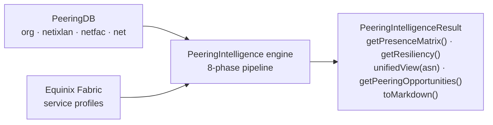
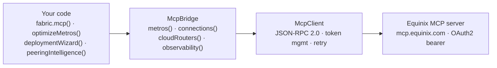
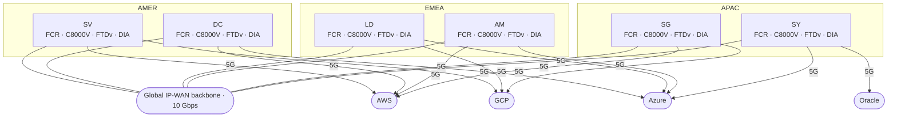
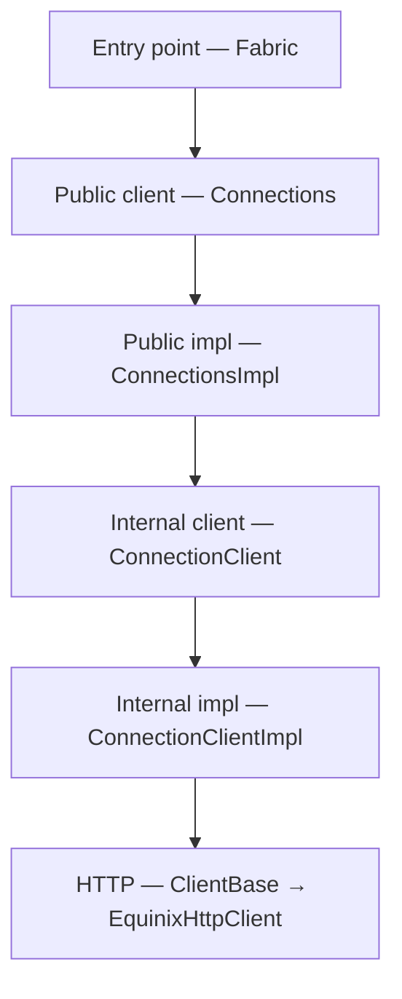

# Equinix Java SDK

[](https://opensource.org/licenses/Apache-2.0)
[](https://openjdk.java.net/)
[](https://iantjones.github.io/equinix-java-sdk/)
[](https://central.sonatype.com/artifact/com.eqixiac.equinix/equinix-sdk-java)

> A Java client for the Equinix platform APIs — Fabric, Network Edge, Customer Portal, IBX SmartView, Internet Access, Projects, IAM, and STS — plus a `Design` module (metro optimizer, deployment wizard, peering intelligence, cost calculators) and an `Mcp` client.

**[View Full API Documentation (Javadoc)](https://iantjones.github.io/equinix-java-sdk/)** · **[Maven Central](https://central.sonatype.com/artifact/com.eqixiac.equinix/equinix-sdk-java)**

## What's in the box

The SDK covers all eight Equinix API domains — Fabric, Network Edge, Customer Portal, IBX SmartView,
Internet Access, Projects, IAM, and STS — with fluent builders for both create and update. A few
things it handles so you don't have to:

- **OAuth2**, token refresh on expiry included. Open an `Equinix` session and every domain shares a
  single token and connection pool.
- **Pagination** — `loadAll()`/`stream()` when you want the whole set, lazy paging when you don't.
- **Errors** mapped from HTTP status onto a typed exception hierarchy you can actually `catch`.
- **Cloud provider adapters** — AWS Direct Connect, Azure ExpressRoute, Google Cloud Interconnect,
  Oracle FastConnect — that drop straight into the Fabric connection builder.
- **Dry-run validation** for Fabric connections and service tokens before you commit to anything.
- **Real-time streaming** from IBX SmartView (AWS IoT, Azure Event Hub, webhook, REST).

On top of the raw API, the **`Design`** module is for planning rather than provisioning: a
metro-placement optimizer, a deployment wizard that turns a plan into provisioned Fabric resources,
peering intelligence built on PeeringDB, IBX-to-IBX latency estimates, and Fabric-vs-internet cost
calculators. The **`Mcp`** module is a JSON-RPC client for the Equinix Model Context Protocol servers.

## Quick Start

### Maven Dependency

```xml
<dependency>
    <groupId>com.eqixiac.equinix</groupId>
    <artifactId>equinix-sdk-java</artifactId>
    <version>2.0.0</version>
</dependency>
```

### Authentication

All domain clients use OAuth2 client credentials. Obtain your Client ID and Client Secret from the [Equinix Developer Portal](https://developer.equinix.com/).

```java
import api.equinix.javasdk.Fabric;
import api.equinix.javasdk.core.auth.BasicEquinixCredentials;

BasicEquinixCredentials credentials = new BasicEquinixCredentials("YOUR_CLIENT_ID", "YOUR_CLIENT_SECRET");
Fabric fabric = new Fabric(credentials);
// Authentication happens automatically on first API call
```

The password grant is also supported for accounts that still require it (Equinix deprecates it in
favour of client credentials):

```java
import api.equinix.javasdk.core.auth.PasswordEquinixCredentials;

PasswordEquinixCredentials credentials =
        new PasswordEquinixCredentials("YOUR_CLIENT_ID", "YOUR_CLIENT_SECRET", "username", "password");
Fabric fabric = new Fabric(credentials);
```

To resolve or rotate credentials at runtime — from a secrets manager, for example — implement
`EquinixCredentialsProvider` and pass it instead of a fixed credentials object. It is consulted on
each authentication (the first call and re-auth on expiry), so a rotated secret takes effect without
rebuilding the client:

```java
import api.equinix.javasdk.core.auth.EquinixCredentialsProvider;

EquinixCredentialsProvider provider = () -> new BasicEquinixCredentials(vault.clientId(), vault.clientSecret());
Fabric fabric = new Fabric(provider);          // also: new Equinix(provider), new NetworkEdge(provider), ...
```

### One session for multiple domains

Each `new Fabric(creds)` / `new NetworkEdge(creds)` stands up its **own** OAuth token and
connection pool. When you use more than one domain, open an `Equinix` session instead — it owns a
**single** token + pool and shares it across every domain (and the design facade):

```java
import api.equinix.javasdk.Equinix;

try (Equinix eq = new Equinix(credentials)) {     // one token, one pool
    Fabric fabric    = eq.fabric();
    NetworkEdge edge = eq.networkEdge();           // shares the same token + pool
    Design design    = eq.design();                // value-add engines over the shared Fabric
    Mcp mcp          = eq.mcp();
}                                                  // closed once for the whole session
```

The standalone `new Fabric(credentials)` constructors remain for the single-domain case.

### Metros and new locations

`MetroCode` is a convenience enum of well-known metros. Because Equinix adds metros over time, the
SDK never depends on the enum being complete:

- Reads never fail on an unlisted metro — a metro the enum does not list deserializes to
  `MetroCode.UNKNOWN`, and the model preserves the real code via `metro.metroId()`.
- `Metro.metroId()` returns a `MetroId` (a normalized code string) that names *any* metro;
  `metroId().asMetroCode()` bridges back to the enum when the metro is well-known.
- `fabric.metroRegistry()` is a cached, live snapshot of every metro (and its IBX data centers)
  from the Metros API — the authoritative set — keyed by `MetroId`:

```java
MetroRegistry registry = fabric.metroRegistry();
registry.get("SV").ifPresent(m -> System.out.println(m.getName() + " " + m.getIbxs()));
boolean exists = registry.contains(someNewCode);   // true even if absent from MetroCode

// Provision against a metro the enum doesn't list yet:
fabric.cloudRouters().define().name("fcr").inMetro("ZZ").withPackage("STANDARD").create();
fabric.metros().getByMetroCode("ZZ");               // String / MetroId overloads
```

By default the catalog is loaded eagerly on the first explicit `authenticate()` (so it's ready up
front) and otherwise lazily on first `metroRegistry()` access. Control this — and the other
construction-time options — with `EquinixConfig`:

```java
Fabric fabric = new Fabric(credentials, EquinixConfig.builder()
    .sandbox(false)
    .autoLoadMetros(false)              // keep the catalog lazy instead of loading it at auth
    .enrichMetroRegistry(true)          // merge EIA per-IBX detail into the metro registry
    .retryPolicy(RetryPolicy.none())    // override the default retry behavior
    .peeringDbApiKey("...")             // PeeringDB credential for peeringIntelligence()
    .build());
// Equinix and every domain client accept EquinixConfig the same way.
```

`enrichMetroRegistry` turns the registry into the SDK's cross-source location directory: Fabric
supplies the metro-level picture (centroids, connected-metro latency, IBX codes) and EIA supplies
the per-IBX detail (coordinates, country) — the only API that has it. The merge is best-effort
(an EIA outage never fails the registry load), and it feeds IBX-to-IBX latency directly:

```java
MetroRegistry registry = fabric.metroRegistry();   // or eq.metroRegistry() on a session
Ibx sv5 = registry.ibx("SV5").orElseThrow();       // full EIA record, case-insensitive lookup
Ibx la4 = registry.ibx("LA4").orElseThrow();
double rttFloor = SpeedOfLightLatency.roundTrip().millisBetween(sv5, la4);
List<Ibx> svIbxes = registry.ibxDetails("SV");     // every enriched IBX in a metro

registry.refresh();   // re-pulls both sources at runtime, atomically, in place —
                      // existing references see new metros/IBXes immediately
```

## Domain Overview

| Domain | Entry Point | Resources | Description |
|--------|-------------|-----------|-------------|
| **Fabric** | `new Fabric(creds)` | 28 | Connections (+ advertised/received routes), Ports (+ search/VLANs), Service Tokens, Cloud Routers (+ route search/commands/validate), Networks, Streams (+ Subscriptions/Alert Rules/Assets), Precision Time (+ packages), Route Filters/Aggregations (+Rules), Routing Protocols (+ BGP actions), Service Profiles, Prices, Metrics, Cloud Events, Marketplace Subscriptions, IP Blocks, Agents (+Templates), Company Profiles (+Tags), Port Packages, Health — all mutable resources support fluent `update()` |
| **Network Edge** | `new NetworkEdge(creds)` | 8 | Virtual Devices (+ soft-reboot/RMA/ACL/file upload), ACL Templates, VPNs, BGP Peerings, Device Links, Public Keys, Backups, Setup |
| **Customer Portal** | `new CustomerPortal(creds)` | 23 | Orders, Order History, Cross-Connects, Trouble Tickets (+ Ticket Orders), Work Visits, Smart Hands, Shipments, Secure Cabinets, Invoices, Billing Accounts, Quotes, Assets, Attachments, Reports, Notifications, Unified Notifications, Support Cases, Support Plans, Digital LOAs, Resellers, Lookups |
| **IBX SmartView** | `new IBXSmartView(creds)` | 8 | Environmental Sensors, Power Events (`dcim/v3`), System Alerts, Streaming Subscriptions, Asset Management, Hierarchy |
| **Internet Access** | `new InternetAccess(creds)` | 14 | EIA v2 Services (full lifecycle), IBX availability, EIA v1 Prices, Accounts, Terms & Conditions, Operational Units, Signature Policies, Product Configurations, Purchase Orders, Orders, Cages, Cabinets, Patch Panels, Connection Services |
| **Projects** | `new Projects(creds)` | 1 | Project listing (read-only, `resourceManager/v2`) |
| **IAM** | `new IAM(creds)` | 8 | Roles, Role Assignments, Access Policies (+Grants), Permission Sets, Principal Policies, Policy Masks, Effective Permissions, Resource Types |
| **STS** | `new STS(creds)` | 3 | Token issuance, OIDC Providers (+suspend/resume), JWKS/OpenID discovery |
| **MCP** | `new Mcp(creds)` | — | Standalone JSON-RPC 2.0 client for the Equinix MCP (Model Context Protocol) servers — discover/invoke tools (supporting types in `api.equinix.javasdk.mcp.*`). To expose *this SDK's* Fabric as MCP tools instead, use `Fabric.mcp()`. |
| **Design** (value-add) | `Design.over(fabric)` / `eq.design()` / `Fabric.optimizeMetros()` … | — | Metro Optimizer, Deployment Wizard, Peering Intelligence, Savings Calculator, TCO comparison (`api.equinix.javasdk.design.*`) — a facade over an existing Fabric client (reuses its transport) |

## Usage Examples

### Fabric: Working with Connections

```java
Fabric fabric = new Fabric(credentials);

// List all connections
PaginatedFilteredList<Connection> connections = fabric.connections().search();
for (Connection conn : connections) {
    System.out.println(conn.getName() + " - " + conn.getState());
}

// Get a specific connection
Connection connection = fabric.connections().getByUuid("your-connection-uuid");

// Get connection statistics
ConnectionStatistic stats = fabric.connections().getStatistics(
    connection.getUuid(),
    LocalDateTime.now().minusDays(1),
    LocalDateTime.now()
);
```

### Fabric: Creating a Connection with the Fluent Builder

```java
Connection newConnection = fabric.connections()
    .define(ConnectionType.EVPL_VC)
    .name("My-AWS-Connection")
    .bandwidth(50)
    .redundancy("my-group", RedundancyPriority.PRIMARY)
    .aSideAccessPointPort(portUuid, LinkProtocol.dot1q().vlanTag(1000).create())
    .zSideAccessPointServiceProfile(profileUuid, LinkProtocol.dot1q().vlanTag(1000).create())
    .notification("ops@example.com")
    .create();

System.out.println("Created: " + newConnection.getUuid());
```

### Fabric: Dry Run Validation

Validate a connection without actually creating it:

```java
Connection validated = fabric.connections()
    .define(ConnectionType.EVPL_VC)
    .name("Test-Connection")
    .bandwidth(100)
    .aSideAccessPointPort(portUuid, LinkProtocol.dot1q().vlanTag(2000).create())
    .zSideAccessPointServiceProfile(profileUuid, LinkProtocol.dot1q().vlanTag(2000).create())
    .dryRun()    // Validates without creating
    .create();
// Returns validation result without side effects
```

### Fabric: Port Discovery and Statistics

```java
// List all ports and find DOT1Q ports
PaginatedList<Port> ports = fabric.ports().list();
Port dot1qPort = ports.stream()
    .filter(p -> p.getEncapsulation().getType() == EncapsulationType.DOT1Q)
    .findFirst()
    .orElseThrow();

// Get port statistics
PortStatistic stats = fabric.ports().getStatistics(
    dot1qPort.getUuid(),
    LocalDateTime.now().minusHours(24),
    LocalDateTime.now()
);
```

### Fabric: Cloud Routers and Routing

```java
// List cloud routers
PaginatedFilteredList<CloudRouter> routers = fabric.cloudRouters().search();

// Get available router packages
PaginatedList<CloudRouterPackage> packages = fabric.cloudRouters().routerPackages();

// List routing protocols for a connection
PaginatedList<RoutingProtocol> protocols = fabric.routingProtocols().list(connectionId);

// Route filters
PaginatedFilteredList<RouteFilter> filters = fabric.routeFilters().search();
```

### Fabric: Real-Time Streams

```java
// List streams
PaginatedList<Stream> streams = fabric.streams().list();

// Create a stream subscription
StreamSubscription sub = fabric.streamSubscriptions()
    .define(streamId)
    .withName("My-Subscription")
    .create();

// List subscriptions for a stream
PaginatedList<StreamSubscription> subs = fabric.streamSubscriptions().list(streamId);
```

### Fabric: Cloud Provider SDK Interoperability

Cloud provider adapters let you hand a provider's own SDK object — an AWS `Connection`, an Azure ExpressRoute service key, a GCP pairing key, an Oracle virtual-circuit OCID — straight to the Fabric connection builder, instead of copying the fields across yourself.

#### Built-in Adapters

| Cloud Provider | Adapter Class | Authentication Key | Region Format |
|---------------|--------------|-------------------|---------------|
| **AWS** | `AwsDirectConnectAdapter` | 12-digit AWS Account ID | `us-east-1` |
| **Azure** | `AzureExpressRouteAdapter` | ExpressRoute Service Key (GUID) | `Silicon Valley` |
| **Google Cloud** | `GoogleCloudInterconnectAdapter` | GCP Pairing Key | `us-east1` |
| **Oracle Cloud** | `OracleFastConnectAdapter` | Virtual Circuit OCID | `us-ashburn-1` |

#### AWS Direct Connect

```java
// Option 1: Wrap an AWS SDK object
AwsDirectConnectAdapter<Connection> adapter = new AwsDirectConnectAdapter<>(
    awsConnection,                              // AWS SDK Connection object
    awsConnection.getOwnerAccount(),            // 12-digit AWS Account ID
    awsConnection.getRegion(),                  // e.g., "us-east-1"
    "equinix-aws-service-profile-uuid"          // Equinix service profile for AWS
);

// Option 2: Manual construction (no AWS SDK dependency)
AwsDirectConnectAdapter<?> adapter = AwsDirectConnectAdapter.of(
    "123456789012", "us-east-1", "equinix-aws-profile-uuid");

// Use the adapter in the connection builder
Connection conn = fabric.connections()
    .define(ConnectionType.EVPL_VC)
    .name("Port-to-AWS-DirectConnect")
    .bandwidth(100)
    .aSideAccessPointPort(portUuid, LinkProtocol.dot1q().vlanTag(1000).create())
    .zSideCloudProvider(adapter, LinkProtocol.dot1q().vlanTag(1000).create())
    .notification("ops@example.com")
    .create();
```

#### Azure ExpressRoute

```java
// Azure requires a peering type (PRIVATE or MICROSOFT)
AzureExpressRouteAdapter<?> adapter = AzureExpressRouteAdapter.of(
    "xxxxxxxx-xxxx-xxxx-xxxx-xxxxxxxxxxxx",     // ExpressRoute Service Key
    "Silicon Valley",                            // Peering location
    "equinix-azure-profile-uuid",                // Equinix service profile
    PeeringType.PRIVATE                          // Private or Microsoft peering
);

Connection conn = fabric.connections()
    .define(ConnectionType.EVPL_VC)
    .name("Port-to-Azure-ExpressRoute")
    .bandwidth(200)
    .aSideAccessPointPort(portUuid, LinkProtocol.dot1q().vlanTag(1500).create())
    .zSideCloudProvider(adapter, LinkProtocol.dot1q().vlanTag(1500).create())
    .notification("ops@example.com")
    .create();
```

#### Google Cloud Interconnect

```java
GoogleCloudInterconnectAdapter<?> adapter = GoogleCloudInterconnectAdapter.of(
    "xxxx/xxxx/xxxx/xxxx",                      // GCP Pairing Key
    "us-east1",                                  // GCP region
    "equinix-gcp-profile-uuid"                   // Equinix service profile
);

Connection conn = fabric.connections()
    .define(ConnectionType.EVPL_VC)
    .name("Port-to-GCP-Interconnect")
    .bandwidth(100)
    .aSideAccessPointPort(portUuid, LinkProtocol.dot1q().vlanTag(2000).create())
    .zSideCloudProvider(adapter, LinkProtocol.dot1q().vlanTag(2000).create())
    .notification("ops@example.com")
    .create();
```

#### Custom Adapter

Implement `CloudProviderConnectionAdapter<T>` for any cloud provider not covered by the built-in adapters:

```java
public class IbmDirectLinkAdapter implements CloudProviderConnectionAdapter<Void> {

    private final String serviceKey;
    private final String region;
    private final String profileUuid;

    public IbmDirectLinkAdapter(String serviceKey, String region, String profileUuid) {
        this.serviceKey = serviceKey;
        this.region = region;
        this.profileUuid = profileUuid;
    }

    @Override public String getServiceProfileUuid()  { return profileUuid; }
    @Override public String getAuthenticationKey()   { return serviceKey; }
    @Override public String getSellerRegion()        { return region; }
    @Override public Void getSource()                { return null; }
    @Override public CloudProviderType getProviderType() { return CloudProviderType.IBM_CLOUD; }
}

// Use exactly like the built-in adapters
Connection conn = fabric.connections()
    .define(ConnectionType.EVPL_VC)
    .name("IBM-DirectLink")
    .bandwidth(50)
    .aSideAccessPointPort(portUuid, LinkProtocol.dot1q().vlanTag(500).create())
    .zSideCloudProvider(new IbmDirectLinkAdapter(serviceKey, "us-south", profileUuid),
                        LinkProtocol.dot1q().vlanTag(500).create())
    .notification("ops@example.com")
    .create();
```

#### Multi-Cloud with Dry Run Validation

Combine cloud provider adapters with Dry Run to validate multi-cloud connections before creating them:

```java
AwsDirectConnectAdapter<?> awsAdapter = AwsDirectConnectAdapter.of(
    "123456789012", "us-east-1", awsProfileUuid);

AzureExpressRouteAdapter<?> azureAdapter = AzureExpressRouteAdapter.of(
    "service-key", "Silicon Valley", azureProfileUuid, PeeringType.PRIVATE);

// Validate AWS connection (dry run - no resources created)
Connection awsValidated = fabric.connections()
    .define(ConnectionType.EVPL_VC)
    .name("AWS-Primary")
    .bandwidth(100)
    .aSideAccessPointPort(portUuid, LinkProtocol.dot1q().vlanTag(1000).create())
    .zSideCloudProvider(awsAdapter, LinkProtocol.dot1q().vlanTag(1000).create())
    .notification("ops@example.com")
    .dryRun()
    .create();

// Validate Azure connection (dry run)
Connection azureValidated = fabric.connections()
    .define(ConnectionType.EVPL_VC)
    .name("Azure-Secondary")
    .bandwidth(200)
    .aSideAccessPointPort(portUuid, LinkProtocol.dot1q().vlanTag(1500).create())
    .zSideCloudProvider(azureAdapter, LinkProtocol.dot1q().vlanTag(1500).create())
    .notification("ops@example.com")
    .dryRun()
    .create();

// Both validated successfully - now create for real (remove .dryRun())
```

### Fabric: Metro Optimizer

Give the optimizer your sites, the providers you need to reach, your workloads, and your constraints,
and it ranks Equinix metros — and tells you why each one landed where it did. You get back a latency
matrix, a suggested workload-to-metro layout, a risk assessment, and a cost estimate.

Scoring weighs five things: latency, provider coverage, cost, redundancy, and compliance. The numbers
come from live Fabric data — inter-metro latency from `Metro.connectedMetros`, provider availability
from `ServiceProfile.metros()`, and pricing from the Prices API — not from a static table.

#### Defining the Optimization

```java
import api.equinix.javasdk.Fabric;
import api.equinix.javasdk.core.enums.MetroCode;
import api.equinix.javasdk.fabric.model.implementation.cloud.CloudProviderType;
import api.equinix.javasdk.design.optimizer.enums.*;
import api.equinix.javasdk.design.optimizer.model.*;

Fabric fabric = new Fabric(credentials);

OptimizationResult result = fabric.optimizeMetros()

    // ── Sites: where your people and operations are ──
    .addSite("New York HQ")
        .nearestMetro(MetroCode.NY)
        .role(SiteRole.HEADQUARTERS)
        .headcount(500)
        .done()
    .addSite("London Office")
        .nearestMetro(MetroCode.LD)
        .role(SiteRole.EMPLOYEE_HUB)
        .headcount(200)
        .done()
    .addSite("Singapore Office")
        .coordinates(1.3521, 103.8198)      // lat/lng when metro code isn't known
        .role(SiteRole.PRIMARY_MARKET)
        .headcount(150)
        .done()
    .addSite("Frankfurt Data Center")
        .nearestMetro(MetroCode.FR)
        .role(SiteRole.DATA_CENTER)
        .headcount(25)
        .done()

    // ── Providers: what you need to connect to ──
    .requireProvider(CloudProviderType.AWS)
        .sellerRegions("us-east-1", "eu-west-1")
        .done()
    .requireProvider(CloudProviderType.AZURE)
        .done()
    .preferProvider("Zoom Video Communications")    // match by service profile name
        .done()
    .preferProvider(CloudProviderType.GOOGLE_CLOUD)
        .done()

    // ── Workloads: what you're running and where it matters ──
    .addWorkload("ML Training Pipeline")
        .type(WorkloadType.AI_ML_TRAINING)          // pre-built profile: high power, liquid cooling
        .bandwidthMbps(10_000)
        .requiresHighPowerDensity()
        .dependsOn(CloudProviderType.AWS)
        .done()
    .addWorkload("Global Video Conferencing")
        .type(WorkloadType.REALTIME_COLLABORATION)  // pre-built: latency-critical, proximity-weighted
        .latencySensitivity(LatencySensitivity.CRITICAL)
        .bandwidthMbps(1_000)
        .done()
    .addWorkload("Customer API Platform")
        .type(WorkloadType.TRANSACTIONAL)
        .bandwidthMbps(2_000)
        .maxLatencyToleranceMs(25.0)                // per-workload latency ceiling
        .dependsOn(CloudProviderType.AZURE)
        .done()
    .addWorkload("Disaster Recovery")
        .type(WorkloadType.DISASTER_RECOVERY)       // pre-built: cost-optimized, relaxed latency
        .bandwidthMbps(500)
        .dependsOn(CloudProviderType.AZURE)
        .done()
    .addWorkload("Genomics Analysis")
        .type(WorkloadType.CUSTOM)                  // fully custom workload profile
        .profile(WorkloadProfile.builder()
            .defaultLatencySensitivity(LatencySensitivity.MEDIUM)
            .requiresHighPowerDensity(true)
            .requiresLiquidCooling(true)
            .maxLatencyToleranceMs(50.0)
            .minBandwidthMbps(5000.0)
            .build())
        .dependsOn(CloudProviderType.AWS)
        .done()

    // ── Constraints: business and compliance boundaries ──
    .constraints()
        .monthlyBudget(50_000, 150_000)             // USD range
        .redundancy(RedundancyTier.MULTI_REGION)    // metros across 2+ regions
        .compliance(ComplianceZone.EU_GDPR)         // at least one EU metro
        .maxLatencyMs(100)                          // global latency ceiling
        .excludeMetro(MetroCode.MX)                 // exclude specific metros
        .maxMetros(5)
        .done()

    // ── Strategy and scoring tuning ──
    .strategy(OptimizationStrategy.BALANCED)
    .scoringWeights(ScoringWeights.builder()
        .latencyWeight(0.35)                        // increase latency importance
        .costWeight(0.15)                           // decrease cost importance
        .latencyExcellentMs(8.0)                    // tighter latency grading curve
        .build())

    // ── Execute ──
    .optimize();
```

#### Working with Results

```java
// ── Quick summary ──
System.out.println(result.toSummary());
// Output:
// Recommended primary metro: Ashburn (DC) with a score of 87.3/100.
// Additional metros: Amsterdam (AM), Silicon Valley (SV), Singapore (SG).
// Estimated monthly cost: $8,750.00 USD.
// Computed in 1243ms.

// ── Primary recommendation ──
MetroRecommendation primary = result.primaryMetro();
System.out.println(primary.getMetroId());             // DC (MetroId.toString() is the code)
System.out.println(primary.getScore().getComposite()); // 87.3
System.out.println(primary.getReasons());
// [Excellent average latency of 12.4ms to user sites,
//  All 4 required/preferred providers available,
//  Located in AMER region]

// ── Score breakdown ──
MetroScore score = primary.getScore();
System.out.println("Latency:    " + score.latencyScore());      // 91.2
System.out.println("Providers:  " + score.providerScore());     // 100.0
System.out.println("Cost:       " + score.costScore());         // 80.0
System.out.println("Redundancy: " + score.redundancyScore());   // 90.0
System.out.println("Compliance: " + score.complianceScore());   // 100.0

// ── Latency matrix (ASCII table) ──
System.out.println(result.getLatencyMatrix().toTableString());
// Metro |  New York HQ | London Office | Singapore Office | Frankfurt DC
// ------+--------------+---------------+------------------+-------------
// DC    |         8.2  |        73.4   |           198.5* |        89.1
// AM    |        73.1  |        10.2   |           162.3* |        7.8
// SV    |        61.5  |       138.7*  |           172.1* |       152.3*
// SG    |       230.1* |       171.2*  |             1.4  |       163.8*
//
// * = estimated (no direct latency data available)

// ── Deployment topology ──
DeploymentTopology topology = result.getTopology();
System.out.println(topology.summary());
// Deployment Topology:
//   DC:
//     - Customer API Platform (All required providers available)
//     - Global Video Conferencing (Lowest weighted latency to user sites (12.4ms avg))
//   SV:
//     - ML Training Pipeline (All required providers available)
//     - Genomics Analysis (All required providers available)
//   AM:
//     - Disaster Recovery (Placed in EMEA for geographic diversity from primary)
//   SG:
//     - (edge presence for APAC workforce)

// ── Risk assessment ──
RiskAssessment risks = result.getRiskAssessment();
System.out.println("Resiliency: " + risks.getResiliencyScore() + "/100");
for (RiskFinding finding : risks.getFindings()) {
    System.out.println("[" + finding.getSeverity() + "] " + finding.getDescription());
    if (finding.getRecommendation() != null) {
        System.out.println("  → " + finding.getRecommendation());
    }
}
// [MEDIUM] SG has worst-case latency of 230.1ms which exceeds the 100ms threshold
//   → Consider adding a metro closer to the affected site
// [MEDIUM] Amazon Web Services is only available in 1 of 4 recommended metros
//   → Consider selecting metros where Amazon Web Services has broader presence

// ── Cost estimate ──
CostEstimate cost = result.getCostEstimate();
System.out.println("Monthly: $" + cost.getMonthlyTotal() + " " + cost.getCurrency());
System.out.println("Setup:   $" + cost.getSetupTotal());
System.out.println("Budget:  " + (cost.isWithinBudget() ? "WITHIN" : "OVER"));
for (MetroCostBreakdown metro : cost.getPerMetro()) {
    System.out.println("  " + metro.getMetroId() + ": $" + metro.getMonthlyRecurring() + "/mo");
}

// ── Full markdown report (for architecture review docs) ──
String report = result.toMarkdown();
Files.writeString(Path.of("metro-optimization-report.md"), report);

// ── JSON export (for programmatic consumption) ──
String json = result.toJson();
```

#### Optimization Strategies

The optimizer supports five pre-built strategies that set default scoring weights, plus full customization via `ScoringWeights`:

| Strategy | Latency | Providers | Cost | Redundancy | Compliance | Best For |
|----------|--------:|----------:|-----:|-----------:|-----------:|----------|
| `BALANCED` | 30% | 25% | 20% | 15% | 10% | General-purpose planning |
| `LATENCY_FIRST` | 50% | 20% | 10% | 10% | 10% | Real-time apps, trading |
| `COST_FIRST` | 15% | 15% | 45% | 15% | 10% | Budget-constrained |
| `REDUNDANCY_FIRST` | 20% | 15% | 15% | 40% | 10% | Mission-critical infra |
| `PROVIDER_COVERAGE_FIRST` | 20% | 45% | 15% | 10% | 10% | Multi-cloud strategies |

What-if scenario comparisons:

```java
// Compare strategies by running the same request with different strategies
OptimizationResult balanced = fabric.optimizeMetros()
    .addSite("NYC").nearestMetro(MetroCode.NY).role(SiteRole.HEADQUARTERS).headcount(500).done()
    .requireProvider(CloudProviderType.AWS).done()
    .strategy(OptimizationStrategy.BALANCED).optimize();

OptimizationResult latencyFirst = fabric.optimizeMetros()
    .addSite("NYC").nearestMetro(MetroCode.NY).role(SiteRole.HEADQUARTERS).headcount(500).done()
    .requireProvider(CloudProviderType.AWS).done()
    .strategy(OptimizationStrategy.LATENCY_FIRST).optimize();

System.out.println("Balanced:      " + balanced.primaryMetro().getMetroId());
System.out.println("Latency-first: " + latencyFirst.primaryMetro().getMetroId());
```

#### Built-in Workload Types

Each workload type carries a default infrastructure profile that drives placement decisions. Use `WorkloadType.CUSTOM` with a `WorkloadProfile` for workloads not covered by the built-in types.

| Workload Type | Latency Sensitivity | High Power | Liquid Cooling | Proximity-Weighted |
|---------------|:-------------------:|:----------:|:--------------:|:------------------:|
| `AI_ML_TRAINING` | Medium | Yes | Yes | No |
| `AI_ML_INFERENCE` | High | Yes | No | No |
| `REALTIME_COLLABORATION` | Critical | No | No | Yes |
| `TRANSACTIONAL` | High | No | No | No |
| `DISASTER_RECOVERY` | Low | No | No | No |
| `COLD_BACKUP` | Low | No | No | No |
| `GENERAL_COMPUTE` | Medium | No | No | No |
| `EDGE_COMPUTE` | Critical | No | No | Yes |
| `BIG_DATA_ANALYTICS` | Medium | Yes | No | No |

### Fabric: Deployment Wizard — From Optimization to Execution

Hand the wizard a finished `OptimizationResult` and it works out the concrete plan: a Cloud Router in
each metro, the connections to your cloud providers, inter-metro backbone links, and the routing
protocols to wire them together. Bandwidth sizing is what makes the pricing real, so it's front and
centre. Review the plan, dry-run it against Fabric, then execute.

#### Generate a Deployment Plan

```java
// Start with a completed optimization
OptimizationResult result = fabric.optimizeMetros()
    .addSite("NYC HQ").nearestMetro(MetroCode.NY).role(SiteRole.HEADQUARTERS).headcount(500).done()
    .requireProvider(CloudProviderType.AWS).sellerRegions("us-east-1").done()
    .requireProvider(CloudProviderType.AZURE).done()
    .addWorkload("ML Training").type(WorkloadType.AI_ML_TRAINING).bandwidthMbps(10_000)
        .dependsOn(CloudProviderType.AWS).done()
    .addWorkload("DR Backup").type(WorkloadType.DISASTER_RECOVERY).bandwidthMbps(500)
        .dependsOn(CloudProviderType.AZURE).done()
    .constraints().redundancy(RedundancyTier.MULTI_METRO).maxMetros(3).done()
    .strategy(OptimizationStrategy.BALANCED)
    .optimize();

// Configure and generate the deployment plan
DeploymentPlan plan = fabric.deploymentWizard(result)
    .routerPackage("STANDARD")                           // Cloud Router package
    .routerNamePrefix("FCR")                             // Router naming: FCR-DC, FCR-SV, etc.
    .providerConnectionType(ConnectionType.EVPL_VC)      // Connection type for providers
    .backboneBandwidthMbps(10_000)                       // Inter-metro backbone bandwidth
    .backboneTopology(BackboneTopology.FULL_MESH)        // Full mesh between all metros
    .bandwidthStrategy(BandwidthStrategy.PER_WORKLOAD)   // Size connections per workload
    .customerAsn(65100L)                                 // BGP customer ASN
    .withBFD(true, 300)                                  // BFD enabled, 300ms interval
    .accountNumber(272010L)                              // Billing account
    .projectId("your-project-uuid")                      // Project grouping
    .notifications("noc@example.com")                    // Provisioning alerts
    .plan();
```

#### Review the Plan

```java
// Full markdown report with bandwidth and pricing tables
System.out.println(plan.toMarkdown());

// Quick summary
System.out.println(plan.toSummary());
// → "Deployment Plan: 3 Cloud Router(s), 4 provider connection(s), 3 backbone link(s),
//    14 routing protocol(s). Total resources: 24. Estimated monthly cost: $25,400 USD."

// Inspect individual components
plan.getCloudRouters().forEach(cr ->
    System.out.println(cr.getName() + " in " + cr.getMetroId()));

plan.getProviderConnections().forEach(conn ->
    System.out.println(conn.getName() + ": " + conn.getBandwidthMbps() + " Mbps → "
        + conn.getZSideProviderLabel()));

plan.getBackboneLinks().forEach(link ->
    System.out.println(link.getMetroA() + " ↔ " + link.getMetroZ()
        + ": " + link.getBandwidthMbps() + " Mbps"));
```

#### Validate and Execute

```java
// Dry-run validation against Fabric API
DeploymentPlan validated = plan.dryRun();
if (!validated.isValid()) {
    validated.getValidationErrors().forEach(System.err::println);
}

// Execute — creates all resources in order:
// 1. Cloud Routers  2. Provider Connections  3. Backbone Links  4. Routing Protocols
DeploymentOutcome outcome = plan.execute();

System.out.println(outcome.toMarkdown());
// Shows provisioned resource UUIDs, statuses, and any errors
```

#### Backbone Topology Options

| Topology | Links (N metros) | Description |
|----------|:-----------------:|-------------|
| `FULL_MESH` | N*(N-1)/2 | Every metro pair connected directly. Maximum redundancy. |
| `HUB_SPOKE` | N-1 | Primary metro connects to all others. Cost-effective. |
| `RING` | N | Metros connected in a ring. Balanced cost and redundancy. |

#### Bandwidth Sizing Strategies

| Strategy | Description |
|----------|-------------|
| `PER_WORKLOAD` | Each provider connection sized to the sum of dependent workload bandwidths. Most accurate for pricing. |
| `AGGREGATED` | All connections at a metro sized to total metro bandwidth. Simpler provisioning. |
| `CUSTOM` | User supplies explicit bandwidth values via `customBandwidthMap()`. |

### Fabric: Peering Intelligence

This one cross-references [PeeringDB](https://www.peeringdb.com/) against Equinix's own IXes and
facilities to answer questions like "where are AWS, Azure, and Google all reachable at an Equinix
exchange?" and "if Ashburn went down, who would I lose?" It builds presence matrices, resiliency
assessments, and peering opportunities — all scoped to Equinix. A PeeringDB API key is optional;
without one you get PeeringDB's anonymous rate limit (~20 requests/minute), which is fine for a few
ASNs. The key (created on [peeringdb.com](https://docs.peeringdb.com/howto/api_keys/) — it's separate
from your Equinix credentials) can be passed inline as below, set once via
`EquinixConfig.builder().peeringDbApiKey("...")` on the client or session, or exported as the
`PEERINGDB_API_KEY` environment variable — resolved in that order.

#### Presence Matrix — Which ASNs Are Where?

```java
// Build a presence matrix for target ASNs across all Equinix metros
PeeringIntelligenceResult result = fabric.peeringIntelligence("your-peeringdb-api-key")
    .addAsn(16509, "AWS")
    .addAsn(8075, "Microsoft")
    .addAsn(15169, "Google")
    .addAsn(13335, "Cloudflare")
    .analyze();

// ASCII matrix: rows = ASNs, columns = Equinix metros
System.out.println(result.getPresenceMatrix().toTableString());
// Network           AM    AT    CH    DA    DC    FR    HK    LA  ...
// -----------------------------------------------------------------------
// AWS                IX    IX    IX    IX    IX    IX    IX    IX  ...
// Microsoft          IX   --     IX    IX    IX    IX    IX   --   ...
// Google             IX    IX    IX    IX    IX    IX    IX    IX  ...
// Cloudflare         IX   --     IX    IX    IX    IX    IX    IX  ...

// Detailed matrix with port capacity and route server indicators
System.out.println(result.getPresenceMatrix().toDetailedTableString());
// Network         AM          CH          DA          DC          FR     ...
// --------------------------------------------------------------------------
// AWS        IX:100G*    IX:10G*     IX:10G*    IX:100G*    IX:100G*    ...
// Microsoft  IX:10G      IX:10G*     IX:10G     IX:100G*    IX:10G      ...
//   (* = route server participant)
```

#### Metro-Centric View — Who Can I Peer With Here?

```java
// Which ASNs are available at Ashburn?
// Peering lookups are keyed by MetroId (import api.equinix.javasdk.core.model.MetroId)
MetroPresenceReport dcReport = result.metroReport(MetroId.of(MetroCode.DC));
System.out.println("ASNs with IX peering at DC: " + dcReport.withIxPeering().size());
System.out.println("Total IX capacity: " + dcReport.totalIxCapacityMbps() / 1000 + " Gbps");

// Find metros where ALL target ASNs are present
List<MetroId> fullCoverage = result.getPresenceMatrix()
    .metrosWithAllAsns(List.of(16509L, 8075L, 15169L));
System.out.println("Metros with all 3 providers: " + fullCoverage);
```

#### Network Profiles — Peering Policy & Feasibility

```java
// Examine network metadata from PeeringDB
NetworkPresence aws = result.networkPresence(16509);
System.out.println("AWS peering policy: " + aws.getPeeringPolicy());      // OPEN
System.out.println("AWS network type: " + aws.getNetworkType());           // CONTENT
System.out.println("AWS IX metros: " + aws.ixMetroCount());                // 25+
System.out.println("AWS total IX capacity: " + aws.getTotalIxCapacityMbps() / 1000 + " Gbps");
System.out.println("AWS uses route servers: " + aws.isRouteServerParticipant()); // true
System.out.println("AWS supports BFD: " + aws.isBfdSupported());           // true
```

#### Resiliency Analysis — Blast Radius & Failover Paths

```java
// Full analysis with customer context
PeeringIntelligenceResult result = fabric.peeringIntelligence("your-peeringdb-api-key")
    .addAsn(16509, "AWS")
    .addAsn(8075, "Microsoft")
    .addAsn(13335, "Cloudflare")
    .customerMetros(MetroCode.DC, MetroCode.DA, MetroCode.SG)
    .includeResiliency(true)
    .analyze();

// What happens if Ashburn goes dark?
BlastRadiusReport dcBlast = result.getResiliency().blastRadiusFor(MetroId.of(MetroCode.DC));
System.out.println("Impact: " + (int)(dcBlast.getImpactRatio() * 100) + "% of connectivity");
System.out.println("Lost IX peering: " + dcBlast.getLostIxPeeringLabels());
System.out.println("Lost IX capacity: " + dcBlast.getLostIxCapacityMbps() / 1000 + " Gbps");
System.out.println("Severity: " + dcBlast.getSeverity());

// Where can I failover AWS peering?
List<FailoverPath> awsFailovers = result.getResiliency().failoverPathsForAsn(16509);
for (FailoverPath fp : awsFailovers) {
    System.out.println(fp.getFailoverMetro() + ": " + fp.getIxCapacityMbps() / 1000 + "G"
        + " (diversity: " + fp.getDiversity().getRating() + ")"
        + " — " + fp.getRecommendation());
}

// Correlated failure detection
for (CorrelatedFailure cf : result.getResiliency().criticalCorrelations()) {
    System.out.println("[" + cf.getSeverity() + "] " + cf.getFailureDomain()
        + ": " + cf.getRecommendation());
}

// Overall resiliency score
System.out.println("Resiliency: " + result.getResiliency().getOverallRating()
    + " (" + (int)(result.getResiliency().getOverallScore() * 100) + "%)");
```

#### Speed-of-Light Latency — IBX-to-IBX, Metro-to-Metro, or Mixed

The diversity RTT above comes from `design.geo.SpeedOfLightLatency`, a reusable calculator that
estimates fibre latency from coordinates (great-circle distance × speed of light in fibre,
~4.9 µs/km one-way). It accepts any mix of the SDK's location types:

| Endpoints | Overload | Coordinate source | Precision |
|---|---|---|---|
| IBX ↔ IBX | `millisBetween(Ibx, Ibx)` | `internetAccess.ibxs()` (EIA) | per data center — same-metro pairs get a real, non-zero figure |
| Metro ↔ Metro | `millisBetween(Metro, Metro)` | `fabric.metros()` | metro centroid — city-to-city planning |
| IBX ↔ Metro | `millisBetween(Ibx, Metro)` (either order) | both | mixed — "my cage in LA4 to the Dallas metro" |
| raw | `millisForKm(km)`, `distanceKm(lat, lon, lat, lon)` | none | fully offline |

```java
import api.equinix.javasdk.design.geo.SpeedOfLightLatency;

// Inputs: IBXes come from EIA (the only per-IBX coordinate source in the Equinix catalog);
// metros come from Fabric.
Ibx la4  = internetAccess.ibxs().getByCode("LA4");
Ibx sv5  = internetAccess.ibxs().getByCode("SV5");
Metro dc = fabric.metros().getByMetroCode(MetroCode.DC);
Metro sv = fabric.metros().getByMetroCode(MetroCode.SV);

// Round-trip (RTT) speed-of-light floor — RTT is the default
SpeedOfLightLatency rtt = SpeedOfLightLatency.roundTrip();
double ibxToIbx     = rtt.millisBetween(la4, sv5);   // precise
double metroToMetro = rtt.millisBetween(dc, sv);     // centroids
double ibxToMetro   = rtt.millisBetween(la4, dc);    // mixed
double km           = SpeedOfLightLatency.distanceKm(la4, sv5);

// One-way, with a realistic non-direct-fibre route factor (must be >= 1.0)
SpeedOfLightLatency realistic = SpeedOfLightLatency.builder()
    .mode(SpeedOfLightLatency.Mode.ONE_WAY)
    .routeFactor(1.4)          // 1.0 = theoretical floor; ~1.3–1.5 = real terrestrial routes
    .refractiveIndex(1.467)    // single-mode fibre (the default)
    .build();
double oneWayMs = realistic.millisBetween(la4, sv5);
```

Every typed overload throws `IllegalArgumentException` naming the offending IBX/metro if it has no
coordinates (`geoCoordinates` is optional in both source APIs) — better loud than a bogus zero. The
result is a physical lower bound; it excludes switching, queuing, and serialization delay. For
metro pairs, compare the floor against Equinix's *measured* backbone RTT:
`metro.getConnectedMetros()` carries `avgLatency` in ms — physics vs. what the network delivers.

#### Mutual Peering Opportunity Discovery

```java
// Discover where you and a target ASN are both at the same Equinix IX
PeeringIntelligenceResult result = fabric.peeringIntelligence("your-peeringdb-api-key")
    .addAsn(16509, "AWS")
    .addAsn(13335, "Cloudflare")
    .customerAsn(65100L)  // your ASN
    .analyze();

for (PeeringOpportunity opp : result.getPeeringOpportunities()) {
    System.out.println(opp.getTargetLabel() + " at " + opp.getMetro()
        + " (" + opp.getIxName() + ")"
        + " — " + opp.getComplexity()
        + " [feasibility: " + (int)(opp.getFeasibility() * 100) + "%]");
    // "AWS at DC (Equinix Ashburn) — Automatic [feasibility: 100%]"
    // "Cloudflare at DC (Equinix Ashburn) — Simple [feasibility: 100%]"
}
```

#### Full Markdown Report

```java
// Generate the full report (every section)
System.out.println(result.toMarkdown());
// Outputs: Presence Matrix, Network Profiles, Resiliency Assessment,
//          Correlated Failures, Peering Opportunities, Unified Connectivity Views
```

#### Data Flow



### Design: Savings Calculator & TCO Comparison

Beyond placement, the `Design` module estimates the cost of moving cloud egress onto Equinix Fabric.
The **Savings Calculator** prices a single egress profile; the **TCO comparison** contrasts
public-internet egress against Fabric over a term. Both reuse the live cloud-provider pricing
adapters (AWS / Azure / GCP / Oracle) and the layered rate card.

```java
import api.equinix.javasdk.design.value.savings.SavingsEstimate;
import api.equinix.javasdk.design.value.savings.DataUnit;
import api.equinix.javasdk.design.value.ratecard.Term;
import api.equinix.javasdk.design.value.tco.TcoComparison;
import api.equinix.javasdk.fabric.model.implementation.cloud.CloudProviderType;
import api.equinix.javasdk.core.enums.MetroCode;

// What does 50 TB/mo of AWS egress cost over Fabric vs. the public internet?
SavingsEstimate savings = fabric.savingsCalculator()
    .egress(50, DataUnit.TERABYTE)
    .fromCloud(CloudProviderType.AWS).inRegion("us-east-1")
    .viaMetro(MetroCode.DC).bandwidthMbps(10_000)
    .term(Term.MONTH_12)          // optional; defaults to Term.MONTH_12
    .calculate();
System.out.println(savings.toMarkdown());

// Full term TCO comparison
TcoComparison tco = fabric.tcoComparison()
    .egress(100, DataUnit.TERABYTE)
    .fromCloud(CloudProviderType.AWS).inRegion("us-east-1")
    .viaMetro(MetroCode.DC).bandwidthMbps(10_000)
    .compare();
System.out.println(tco.toMarkdown());
```

Both are equivalently reachable via the design facade: `Design.over(fabric).savingsCalculator()` /
`.tcoComparison()` (or `eq.design()…`).

### Fabric: MCP Bridge

The MCP bridge talks to the [Equinix MCP servers](https://docs.equinix.com/equinix-api/mcp-servers/overview/) over JSON-RPC 2.0. There are typed helpers for the everyday things — metros, connections, cloud routers, observability — plus `availableTools()` to list the server's full catalog and `callTool(name, args)` for anything not yet wrapped. Responses come back as typed Java objects.

> **Note:** The Equinix MCP server is currently in Private Beta. Contact `fabric-intelligence-support@equinix.com` or your Equinix account representative for access.

#### Direct MCP Access

```java
Fabric fabric = new Fabric(credentials);

// Access the MCP Bridge (auto-initializes on first call)
McpBridge mcp = fabric.mcp();

// List all available MCP tools
Map<String, McpToolDefinition> tools = mcp.availableTools();
System.out.println("Available tools: " + tools.size());

// Query metro data via MCP
List<McpMetroBridge.McpMetro> metros = mcp.metros().listMetros();
for (McpMetroBridge.McpMetro metro : metros) {
    System.out.println(metro.getCode() + " - " + metro.getName()
        + " (" + metro.getRegion() + ", " + metro.getConnectedMetroCount() + " connected)");
}

// Get details for a specific metro
McpMetroBridge.McpMetro sv = mcp.metros().getMetro("SV");
System.out.println(sv.getName() + " in " + sv.getCountry());
```

#### Connection Validation

```java
// Validate a connection configuration before creation
McpConnectionBridge.McpConnectionValidation result =
    mcp.connections().validateConnection(Map.of(
        "type", "EVPL_VC",
        "name", "My-AWS-Connection",
        "bandwidth", 1000
    ));

System.out.println("Valid: " + result.isValid());      // true
System.out.println("Message: " + result.getMessage());  // "Connection configuration is valid"

// Search existing connections
List<McpConnectionBridge.McpConnection> connections =
    mcp.connections().searchConnections(Map.of("state", "ACTIVE"));
```

#### Observability & Metrics

```java
// Get live metrics for a connection
McpObservabilityBridge.McpMetrics metrics = mcp.observability().getMetrics(
    "connection", connectionUuid, "bandwidth",
    "2026-03-01T00:00:00Z", "2026-03-25T00:00:00Z");

System.out.println("Avg bandwidth: " + metrics.getAvg() + " Mbps");
System.out.println("Peak: " + metrics.getMax() + " Mbps");

// List observability streams
List<McpObservabilityBridge.McpStream> streams = mcp.observability().listStreams();

// Search cloud events
JsonNode events = mcp.observability().searchCloudEvents(Map.of(
    "resourceType", "connection",
    "severity", "WARNING"
));
```

#### MCP-Enriched Optimization

The Deployment Wizard accepts an optional MCP bridge to validate planned connections against the live MCP server before the plan is returned. When MCP is unavailable, validation is skipped with no code changes.

```java
// Deployment Wizard with MCP validation
DeploymentPlan plan = fabric.deploymentWizard(result)
    .withMcpValidation(fabric.mcp())  // validate connections via MCP
    .routerPackage("STANDARD")
    .routerNamePrefix("FCR")
    .backboneTopology(BackboneTopology.FULL_MESH)
    .bandwidthStrategy(BandwidthStrategy.PER_WORKLOAD)
    .customerAsn(65100L)
    .plan();

// Peering Intelligence (PeeringDB + optional live Fabric data)
PeeringIntelligenceResult peeringResult = fabric.peeringIntelligence("your-peeringdb-api-key")
    .addAsn(16509, "AWS")
    .addAsn(8075, "Microsoft")
    .customerMetros(MetroCode.DC, MetroCode.DA)
    .includeResiliency(true)
    .analyze();
```

#### Custom MCP Configuration

```java
// Use custom endpoints, timeouts, or retry policy
McpClientConfig config = McpClientConfig.builder()
    .fabricEndpoint("https://mcp.equinix.com/fabric")
    .peeringInsightsEndpoint("https://mcp.equinix.com/peeringInsights")
    .connectTimeoutMs(15_000)
    .readTimeoutMs(60_000)
    .maxRetries(3)
    .build();

McpBridge mcp = fabric.mcp(config);
```

#### Architecture



### Enterprise Multi-Metro Deployment

A larger end-to-end example spanning Fabric, Network Edge, and Internet Access. It stands up a Cloud
Router in six metros across three regions, wires each to two cloud providers at 5 Gbps, drops a Cisco
C8000V router and an FTDv firewall into every metro, links the lot over a 10 Gbps IP-WAN backbone, and
runs BGP on every connection. It's long, but it's one flow — builders, cloud adapters, and routing
config all pulling together.



Every FCR joins the IP-WAN backbone, so routes propagate between metros over BGP — the cross-region
paths (SV↔SY, SV↔SG, DC↔LD, DC↔AM) come for free, with no direct FCR-to-FCR connections.

```java
import api.equinix.javasdk.*;
import api.equinix.javasdk.core.auth.BasicEquinixCredentials;
import api.equinix.javasdk.core.enums.*;
import api.equinix.javasdk.fabric.enums.*;
import api.equinix.javasdk.fabric.model.*;
import api.equinix.javasdk.fabric.model.implementation.LinkProtocol;
import api.equinix.javasdk.fabric.model.implementation.cloud.*;
import api.equinix.javasdk.networkedge.enums.*;
import api.equinix.javasdk.networkedge.model.Device;

import java.util.*;

public class GlobalNetworkDeployment {

    // --- Configuration ---
    static final String PROJECT_ID    = "your-project-uuid";
    static final Long   ACCOUNT_NO    = 272010L;
    static final String NOTIFY_EMAIL  = "noc@example.com";
    static final Long   CUSTOMER_ASN  = 65100L;
    static final String IPWAN_NETWORK = "your-global-ipwan-network-uuid";

    // Service profile UUIDs (obtain from Equinix portal or fabric.serviceProfiles().search())
    static final String AWS_PROFILE   = "aws-direct-connect-profile-uuid";
    static final String AZURE_PROFILE = "azure-expressroute-profile-uuid";
    static final String GCP_PROFILE   = "google-cloud-interconnect-profile-uuid";
    static final String OCI_PROFILE   = "oracle-fastconnect-profile-uuid";

    public static void main(String[] args) {

        // ---------------------------------------------------------------
        // Phase 1: Initialize SDK Clients
        // ---------------------------------------------------------------
        BasicEquinixCredentials credentials =
                new BasicEquinixCredentials("YOUR_CLIENT_ID", "YOUR_CLIENT_SECRET");

        Fabric fabric             = new Fabric(credentials);
        NetworkEdge networkEdge   = new NetworkEdge(credentials);
        InternetAccess internet   = new InternetAccess(credentials);

        // Metro layout: 6 metros across 3 regions
        MetroCode[] metros = { MetroCode.SV, MetroCode.DC, MetroCode.LD,
                               MetroCode.AM, MetroCode.SG, MetroCode.SY };

        // ---------------------------------------------------------------
        // Phase 2: Create Fabric Cloud Routers (one per metro)
        // ---------------------------------------------------------------
        Map<MetroCode, CloudRouter> routers = new LinkedHashMap<>();

        for (MetroCode metro : metros) {
            CloudRouter fcr = fabric.cloudRouters().define()
                    .name("FCR-" + metro)
                    .inMetro(metro)
                    .withPackage("STANDARD")
                    .accountNumber(ACCOUNT_NO)
                    .projectId(PROJECT_ID)
                    .notification("ALL", List.of(NOTIFY_EMAIL))
                    .create();

            routers.put(metro, fcr);
            System.out.println("Created FCR in " + metro + ": " + fcr.getUuid());
        }

        // ---------------------------------------------------------------
        // Phase 3: Provision Network Edge Devices (Cisco C8000V + FTDv per metro)
        // ---------------------------------------------------------------
        Map<MetroCode, Device> ciscoRouters  = new LinkedHashMap<>();
        Map<MetroCode, Device> ciscoFirewalls = new LinkedHashMap<>();

        for (MetroCode metro : metros) {
            // Cisco Catalyst 8000V — enterprise SD-WAN router
            Device router = networkEdge.devices().define("C8000V-" + metro)
                    .withDeviceTypeCode("C8000V")
                    .withMetroCode(metro)
                    .withCore(4)
                    .withPackageCode("network-essentials")
                    .withVersion("17.06.01a")
                    .withDeviceManagementType(DeviceManagementType.SELF_CONFIGURED)
                    .withLicenseMode(LicenseType.SUB)
                    .withThroughput(500)
                    .withThroughputUnit(BandwidthUnit.MBPS)
                    .withInterfaceCount(10)
                    .withNotification(NOTIFY_EMAIL)
                    .create();

            ciscoRouters.put(metro, router);

            // Cisco Secure Firewall Threat Defense (FTDv) — next-gen firewall
            Device firewall = networkEdge.devices().define("FTDv-" + metro)
                    .withDeviceTypeCode("FTD")
                    .withMetroCode(metro)
                    .withCore(4)
                    .withPackageCode("STD")
                    .withVersion("7.2.0")
                    .withDeviceManagementType(DeviceManagementType.SELF_CONFIGURED)
                    .withLicenseMode(LicenseType.SUB)
                    .withThroughput(500)
                    .withThroughputUnit(BandwidthUnit.MBPS)
                    .withInterfaceCount(10)
                    .withNotification(NOTIFY_EMAIL)
                    .create();

            ciscoFirewalls.put(metro, firewall);
        }

        // ---------------------------------------------------------------
        // Phase 4: Connect FCRs to Cloud Providers (2 per metro, 5 Gbps each)
        // ---------------------------------------------------------------

        // Define cloud provider adapters per metro
        Map<MetroCode, List<CloudProviderConnectionAdapter<?>>> cloudAdapters = Map.of(
            MetroCode.SV, List.of(
                AwsDirectConnectAdapter.of("123456789012", "us-west-1", AWS_PROFILE),
                GoogleCloudInterconnectAdapter.of("pairing-key-sv", "us-west1", GCP_PROFILE)),
            MetroCode.DC, List.of(
                AwsDirectConnectAdapter.of("123456789012", "us-east-1", AWS_PROFILE),
                AzureExpressRouteAdapter.of("azure-service-key-dc", "eastus", AZURE_PROFILE, PeeringType.PRIVATE)),
            MetroCode.LD, List.of(
                AzureExpressRouteAdapter.of("azure-service-key-ld", "uksouth", AZURE_PROFILE, PeeringType.PRIVATE),
                GoogleCloudInterconnectAdapter.of("pairing-key-ld", "europe-west2", GCP_PROFILE)),
            MetroCode.AM, List.of(
                AwsDirectConnectAdapter.of("123456789012", "eu-west-1", AWS_PROFILE),
                AzureExpressRouteAdapter.of("azure-service-key-am", "westeurope", AZURE_PROFILE, PeeringType.PRIVATE)),
            MetroCode.SG, List.of(
                AwsDirectConnectAdapter.of("123456789012", "ap-southeast-1", AWS_PROFILE),
                GoogleCloudInterconnectAdapter.of("pairing-key-sg", "asia-southeast1", GCP_PROFILE)),
            MetroCode.SY, List.of(
                AzureExpressRouteAdapter.of("azure-service-key-sy", "australiaeast", AZURE_PROFILE, PeeringType.PRIVATE),
                OracleFastConnectAdapter.of("ocid1.virtualcircuit.oc1...", "ap-sydney-1", OCI_PROFILE))
        );

        List<Connection> cloudConnections = new ArrayList<>();

        for (MetroCode metro : metros) {
            CloudRouter fcr = routers.get(metro);
            int idx = 0;
            for (CloudProviderConnectionAdapter<?> adapter : cloudAdapters.get(metro)) {
                Connection conn = fabric.connections()
                        .define(ConnectionType.IP_VC)
                        .name("Cloud-" + metro + "-" + adapter.getProviderType().name() + "-" + (++idx))
                        .bandwidth(5000)
                        .aSideAccessPoint(fcr, null, InterfaceType.CLOUD, null)
                        .zSideCloudProvider(adapter, LinkProtocol.dot1q().vlanTag(1000 + idx).create())
                        .notification(NOTIFY_EMAIL)
                        .create();

                cloudConnections.add(conn);
            }
        }

        // ---------------------------------------------------------------
        // Phase 5: Connect FCRs to Network Edge Devices (router + firewall)
        // ---------------------------------------------------------------
        List<Connection> neConnections = new ArrayList<>();

        for (MetroCode metro : metros) {
            CloudRouter fcr = routers.get(metro);

            // FCR → Cisco C8000V router (1 Gbps)
            Connection routerConn = fabric.connections()
                    .define(ConnectionType.IP_VC)
                    .name("FCR-to-C8000V-" + metro)
                    .bandwidth(1000)
                    .aSideAccessPoint(fcr, null, InterfaceType.CLOUD, null)
                    .zSideAccessPoint(ciscoRouters.get(metro).getUuid(),
                            LinkProtocol.dot1q().vlanTag(2000).create(),
                            InterfaceType.NETWORK, 1)
                    .notification(NOTIFY_EMAIL)
                    .create();

            // FCR → Cisco FTDv firewall (1 Gbps)
            Connection fwConn = fabric.connections()
                    .define(ConnectionType.IP_VC)
                    .name("FCR-to-FTDv-" + metro)
                    .bandwidth(1000)
                    .aSideAccessPoint(fcr, null, InterfaceType.CLOUD, null)
                    .zSideAccessPoint(ciscoFirewalls.get(metro).getUuid(),
                            LinkProtocol.dot1q().vlanTag(2100).create(),
                            InterfaceType.NETWORK, 1)
                    .notification(NOTIFY_EMAIL)
                    .create();

            neConnections.addAll(List.of(routerConn, fwConn));
        }

        // ---------------------------------------------------------------
        // Phase 6: Connect FCRs to Global IP-WAN Backbone (10 Gbps each)
        //
        // A Global IP-WAN network enables automatic route propagation between
        // all connected FCRs via BGP — no direct FCR-to-FCR connections needed.
        // Cross-region links (SV↔SY, SV↔SG, DC↔LD, DC↔AM) are handled
        // automatically through the IP-WAN mesh.
        // ---------------------------------------------------------------
        List<Connection> ipwanConnections = new ArrayList<>();

        for (MetroCode metro : metros) {
            CloudRouter fcr = routers.get(metro);

            Connection ipwanConn = fabric.connections()
                    .define(ConnectionType.IP_VC)
                    .name("IPWAN-" + metro)
                    .bandwidth(10000)
                    .aSideAccessPoint(fcr, null, InterfaceType.CLOUD, null)
                    .zSideAccessPoint(IPWAN_NETWORK,
                            LinkProtocol.untagged().create(),
                            InterfaceType.NETWORK, null)
                    .notification(NOTIFY_EMAIL)
                    .create();

            ipwanConnections.add(ipwanConn);
        }

        // ---------------------------------------------------------------
        // Phase 7: Configure BGP Routing on All Connections
        //
        // Each FCR connection requires two routing protocols:
        //   1. DIRECT — establishes the IP subnet for the peering link
        //   2. BGP    — enables dynamic route exchange with BFD for fast failover
        // ---------------------------------------------------------------
        List<Connection> allConnections = new ArrayList<>();
        allConnections.addAll(cloudConnections);
        allConnections.addAll(neConnections);
        allConnections.addAll(ipwanConnections);

        int subnet = 1;
        for (Connection conn : allConnections) {
            String peerBase = "10.100." + subnet + ".";

            // Step 1: Direct routing protocol (IP addressing)
            fabric.routingProtocols().define()
                    .ofType(RoutingProtocolType.DIRECT)
                    .withName("Direct-" + conn.getName())
                    .withDirectIpv4(peerBase + "1/30")
                    .create(conn);

            // Step 2: BGP routing protocol (dynamic route exchange)
            fabric.routingProtocols().define()
                    .ofType(RoutingProtocolType.BGP)
                    .withName("BGP-" + conn.getName())
                    .withCustomerAsn(CUSTOMER_ASN)
                    .withBGPIpv4(peerBase + "2", peerBase + "1", true)
                    .withBFD(true, 300)
                    .create(conn);

            subnet++;
        }

        // ---------------------------------------------------------------
        // Summary
        // ---------------------------------------------------------------
        System.out.println("\n=== Global Network Deployment Complete ===");
        System.out.println("Cloud Routers:      " + routers.size());
        System.out.println("Network Edge:       " + (ciscoRouters.size() + ciscoFirewalls.size()) + " devices");
        System.out.println("Cloud Connections:  " + cloudConnections.size() + " @ 5 Gbps each");
        System.out.println("NE Connections:     " + neConnections.size() + " @ 1 Gbps each");
        System.out.println("IP-WAN Backbone:    " + ipwanConnections.size() + " @ 10 Gbps each");
        System.out.println("Routing Protocols:  " + (allConnections.size() * 2) + " (DIRECT + BGP)");
    }
}
```

> **Note:** This example uses placeholder UUIDs for service profiles, project IDs, and authentication keys. Replace them with values from your Equinix account. The Global IP-WAN network must be created via the [Equinix Portal](https://portal.equinix.com) before connecting FCRs to it. Internet Access (DIA) is provisioned through the Network Edge devices — see the [Internet Access documentation](https://docs.equinix.com/internet-access/) for connecting DIA services to virtual devices.

### Network Edge: Virtual Devices

```java
NetworkEdge networkEdge = new NetworkEdge(credentials);

// List all devices
PaginatedList<Device> devices = networkEdge.devices().list();

// List available device types
PaginatedList<DeviceType> deviceTypes = networkEdge.devices().listDeviceTypes();

// Create a device with the fluent builder
Device device = networkEdge.devices()
    .define("my-router")
    .withAccountNumber(accountNumber)
    .withMetroCode(MetroCode.SV)
    .withDeviceTypeCode("CSR1000V")
    .withLicenseMode(LicenseType.SUB)
    .withThroughput(500)
    .withThroughputUnit(BandwidthUnit.MBPS)
    .withCore(4)
    .withDeviceManagementType(DeviceManagementType.EQUINIX_CONFIGURED)
    .withPackageCode("IPBASE")
    .create();
```

### Network Edge: ACL Templates, VPNs, and Peerings

```java
// Manage ACL templates
PaginatedList<ACLTemplate> templates = networkEdge.aclTemplates().list();

// BGP peerings
PaginatedList<BGPPeering> peerings = networkEdge.bgpPeerings().list();

// VPN connections
PaginatedList<VPN> vpns = networkEdge.vpns().list();
```

> SSH users are configured on the device at creation time via the device builder, not as a
> standalone resource.

### IBX SmartView: Environmental Monitoring

```java
IBXSmartView smartView = new IBXSmartView(credentials);

// Get environmental sensor readings for a data center
PaginatedList<SensorReading> readings = smartView.environmentals().list("DC2");
for (SensorReading reading : readings) {
    System.out.println(reading.getSensorId() + ": " + reading.getTemperature() + "C");
}

// Search power events for a data center
PaginatedList<PowerEvent> events = smartView.powerEvents()
    .search(List.of("DC2"), null, null, 0, 50);

// Search system alerts
PaginatedList<SystemAlert> alerts = smartView.systemAlerts()
    .search("ACTIVE", null, null, 0, 50);
```

### IBX SmartView: Streaming Subscriptions

```java
// Create a streaming subscription for real-time data
StreamingSubscription subscription = smartView.streamingSubscriptions()
    .define()
    .withChannel(Channel.builder()
        .channelType(ChannelType.WEBHOOK)
        .webhookChannelConfiguration(WebhookChannelConfiguration.builder()
            .url("https://my-app.example.com/webhook").build())
        .build())
    .withMessageType(MessageType.builder()
        .environmental(List.of(EnvironmentalMessageType.builder()
            .accountNumber(accountNumber).ibx(ibxCodes).build()))
        .build())
    .create();

// List existing subscriptions
List<StreamingSubscription> subs = smartView.streamingSubscriptions().list();

// Get subscription data
SubscriptionData data = smartView.streamingSubscriptions()
    .getSubscriptionData(subscription.getId());

// Clean up
subscription.delete();
```

### IBX SmartView: Legacy APIs and Hierarchy

```java
// Location hierarchy for an IBX
List<HierarchyNode> hierarchy = smartView.hierarchy()
    .getLocationHierarchy(accountNo, "DC2");

// Legacy environment data
EnvironmentData envData = smartView.legacyEnvironmentals()
    .getCurrent(accountNo, "DC2", "IBX", "DC2");

// Trending environment data
TrendingEnvironmentData trending = smartView.legacyEnvironmentals()
    .getTrending(accountNo, "DC2", "temperature", "IBX", "DC2",
                 "15min", "2024-01-01", "2024-01-02");
```

### Customer Portal: Operations Management

```java
CustomerPortal portal = new CustomerPortal(credentials);

// List cross-connects
PaginatedList<CrossConnect> crossConnects = portal.crossConnects().list();

// List trouble tickets
PaginatedList<TroubleTicket> tickets = portal.troubleTickets().list();

// List invoices
PaginatedList<InvoiceSummary> invoices = portal.invoices().summaries();

// List work visits
PaginatedList<WorkVisit> visits = portal.workVisits().list();

// SmartHands: discover order types/locations, then place a typed order
List<? extends SmartHandType> types = portal.smartHandsRequests().listTypes();
List<? extends SmartHandsLocation> locations = portal.smartHandsRequests().listLocations();

// The request body (ibxLocation, contacts, schedule, serviceDetails) is built via
// SmartHandsRequestJson; one create method per order type:
SmartHandResponse order = portal.smartHandsRequests().createEquipmentInstall(smartHandsRequest);
```

### Observability: Chaining Resources

Resources chain the way you'd expect — list, filter, then read statistics off what you found:

```java
Fabric fabric = new Fabric(credentials);

// Port -> Connection -> Statistics pipeline
Port port = fabric.ports().list().get(0);
PaginatedFilteredList<Connection> connections = fabric.connections().search();
Connection conn = connections.stream()
    .filter(c -> c.getASide() != null)
    .findFirst()
    .orElseThrow();

ConnectionStatistic stats = fabric.connections().getStatistics(
    conn.getUuid(),
    LocalDateTime.now().minusDays(7),
    LocalDateTime.now()
);

// Cloud Router -> Routing Protocol -> Route Filter chain
PaginatedFilteredList<CloudRouter> routers = fabric.cloudRouters().search();
PaginatedList<RoutingProtocol> protocols = fabric.routingProtocols().list(connectionId);
PaginatedFilteredList<RouteFilter> filters = fabric.routeFilters().search();
```

### Error Handling

Every API error maps to a typed exception, so you can catch just the case you care about and let the
rest propagate:

```java
try {
    Connection conn = fabric.connections().getByUuid("non-existent-uuid");
} catch (EquinixNotFoundException e) {
    // 404 - Resource not found
    System.err.println("Connection not found: " + e.getMessage());
} catch (EquinixAuthenticationException e) {
    // 401 - Invalid credentials
    System.err.println("Authentication failed");
} catch (EquinixRateLimitException e) {
    // 429 - Rate limited
    System.err.println("Rate limited, retry after: " + e.getMessage());
} catch (EquinixServiceException e) {
    // Any other API error
    System.err.println("API error " + e.getStatusCode() + ": " + e.getMessage());
}
```

| HTTP Status | Exception Class |
|-------------|----------------|
| 401 | `EquinixAuthenticationException` |
| 403 | `EquinixAuthorizationException` |
| 404 | `EquinixNotFoundException` |
| 409 | `EquinixConflictException` |
| 429 | `EquinixRateLimitException` |
| 5xx | `EquinixServerException` |

### Pagination

All list operations return `PaginatedList<T>`, an `Iterable<T>` view of the loaded results with
pagination metadata and automatic page loading (it is **not** a `java.util.List`). Iterate it
directly, call `stream()`, snapshot it with `toList()`, page with `hasNextPage()`/`next()`, or eagerly
load every page with `loadAll()`:

```java
PaginatedList<Port> ports = fabric.ports().list();

// Iterate the current page, or stream it
for (Port port : ports) { /* ... */ }
ports.stream().map(Port::getUuid).forEach(System.out::println);

// Eagerly load every page, then snapshot
List<Port> all = fabric.ports().list().loadAll().toList();

// Access pagination info
Pagination pagination = ports.getPagination();
int pageNumber = pagination.getPageNumber();
int pageSize = pagination.getPageSize();
boolean isFirst = pagination.getIsFirstPage();
boolean isLast = pagination.getIsLastPage();
int total = pagination.getTotal();
```

## Testing

### Unit Tests (No Credentials Required)
```bash
mvn test
```
Unit tests cover JSON deserialization, pagination, exception mapping, and the builders (Mockito for the rest).

### WireMock Tests (No Credentials Required)
```bash
mvn test -Pwiremock
```
WireMock tests stand up a local HTTP server that mimics the Equinix APIs, so they exercise the full request/response cycle — URLs, verbs, bodies, pagination, error mapping, OAuth2, JSON-RPC — across every domain without touching a live endpoint or needing credentials.

### Integration Tests (Credentials Required)
```bash
mvn test -Pintegration \
    -Dauth.access=YOUR_CLIENT_ID \
    -Dauth.secret=YOUR_CLIENT_SECRET
```

By default, integration tests run in read-only mode. To enable create/update/delete operations:
```bash
mvn test -Pintegration \
    -Dauth.access=YOUR_CLIENT_ID \
    -Dauth.secret=YOUR_CLIENT_SECRET \
    -DskipCreateUpdateOperations=false
```

## API Reference

Full Javadoc documentation is published at **[iantjones.github.io/equinix-java-sdk](https://iantjones.github.io/equinix-java-sdk/)** and is updated with each release.

Browse Javadocs by domain:
- [Fabric](https://iantjones.github.io/equinix-java-sdk/api/equinix/javasdk/fabric/package-summary.html) — Connections, Ports, Service Tokens, Cloud Routers, Streams
- [Network Edge](https://iantjones.github.io/equinix-java-sdk/api/equinix/javasdk/networkedge/package-summary.html) — Virtual Devices, ACL Templates, VPNs, BGP Peerings
- [Customer Portal](https://iantjones.github.io/equinix-java-sdk/api/equinix/javasdk/customerportal/package-summary.html) — Cross-Connects, Trouble Tickets, Invoices
- [IBX SmartView](https://iantjones.github.io/equinix-java-sdk/api/equinix/javasdk/ibxsmartview/package-summary.html) — Environmental Sensors, Power Events, Streaming
- [Cloud Provider Adapters](https://iantjones.github.io/equinix-java-sdk/api/equinix/javasdk/fabric/model/implementation/cloud/package-summary.html) — AWS, Azure, GCP, Oracle interoperability
- [Metro Optimizer](https://iantjones.github.io/equinix-java-sdk/api/equinix/javasdk/design/optimizer/package-summary.html) — Metro placement engine
- [Deployment Wizard](https://iantjones.github.io/equinix-java-sdk/api/equinix/javasdk/design/optimizer/wizard/package-summary.html) — Optimization-to-execution deployment pipeline
- [Peering Intelligence](https://iantjones.github.io/equinix-java-sdk/api/equinix/javasdk/design/peering/package-summary.html) — Interconnection analysis with PeeringDB integration
- [Speed-of-Light Latency](https://iantjones.github.io/equinix-java-sdk/api/equinix/javasdk/design/geo/package-summary.html) — IBX-to-IBX fibre latency calculator
- [MCP Bridge](https://iantjones.github.io/equinix-java-sdk/api/equinix/javasdk/mcp/bridge/package-summary.html) — JSON-RPC 2.0 client for Equinix MCP servers

## Building

```bash
# Compile
mvn clean compile

# Package (includes source and Javadoc JARs)
mvn clean package -DskipTests

# Generate Javadoc site
mvn javadoc:javadoc
```

## Releases

Pre-built JARs are available as [GitHub Releases](https://github.com/iantjones/equinix-java-sdk/releases). Each release includes:
- `equinix-sdk-java-X.Y.jar` - Compiled SDK
- `equinix-sdk-java-X.Y-sources.jar` - Source code
- `equinix-sdk-java-X.Y-javadoc.jar` - Javadoc documentation

The SDK is also published to [Maven Central](https://central.sonatype.com/artifact/com.eqixiac.equinix/equinix-sdk-java).

## Architecture

The SDK follows a layered architecture:



Resources use either a **full pattern** (with Wrapper + Operator for mutable CRUD) or a **read-only pattern** (JSON model implements the interface directly).

See [CONTRIBUTING.md](CONTRIBUTING.md) for detailed architecture documentation.

## Requirements

- **Java 21** or later
- **Maven 3.6+** for building

### Dependencies
- Jackson 2.21.1 (JSON serialization)
- Apache HttpClient 4.5.14 (HTTP communication)
- Lombok 1.18.42 (compile-time code generation)

## License

This project is licensed under the Apache License 2.0 - see the [LICENSE](LICENSE) file for details.

## Contributing

Contributions are welcome! Please see [CONTRIBUTING.md](CONTRIBUTING.md) for guidelines.
